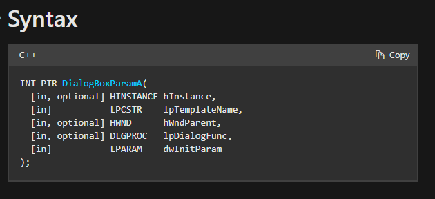
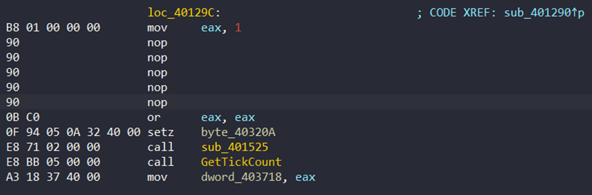

# AntiDebug1


Mở chương trình trong IDA và debug thoy. <br>

<br>

Click run thì chúng ta gặp error như trên, lý do là do đoạn xử lí này.

`xor al, al` clear AL register, tiếp đó gọi `SetUnhandledExceptionFilter` sẽ là hàm xử lí exception bằng `lpTopLevelExceptionFilter`. 
Phần tiếp theo của chương trình:<br>

<br>
Do chúng ta vừa clear AL register(có dính dáng gì đó tới eax và edx :v) và thực hiện `div eax`, nên dính exception divide by 0.

Trong documentation của `SetUnhandledExceptionFilter` có note: <br>

<br>

Do chúng ta đang debug, nên exception sẽ không được xử lí bới `lpTopLevelExceptionFilter`. Chúng ta cần tự xử lí exception.
Đặt breakpoint tại ngay trước `div eax`, F9 run<br>

<br>

F7 chạy tới đoạn `div eax`, chỉnh EIP register thành địa chỉ hàm xử lí exception `40105C`.<br>

<br>

Click vào địa chỉ EIP.<br>

<br>


<br>


<br>

Vậy là đã xử lí được exception, nhưng vẫn chưa vào flow chính của chương trình. Ta cùng xem main<br>
```c
void __usercall __noreturn start(int a1@<esi>)
{
  HMODULE LibraryA; // edi
  unsigned __int64 v2; // rax
  unsigned __int64 v3; // rt2
  char v4; // t1
  HMODULE ModuleHandleA; // eax

  byte_403209 = a1 == -1;
  InitCommonControls();
  strcpy((char *)&loc_401026, "Kernel32");
  LibraryA = LoadLibraryA((LPCSTR)&loc_401026);
  v2 = __PAIR64__((unsigned int)LibraryA, (unsigned int)SetUnhandledExceptionFilter(TopLevelExceptionFilter));
  do
  {
    v3 = v2 % (unsigned int)v2;
    LOWORD(v2) = v2 / (unsigned int)v2;
    HIDWORD(v2) = v3;
    v4 = v2;
    LOBYTE(v2) = BYTE1(v3);
    BYTE5(v2) = v4;
    LODWORD(v2) = (unsigned __int16)v2;
  }
  while ( (v2 & 0xDF) != 0 );
  ModuleHandleA = GetModuleHandleA(0);
  DialogBoxParamA(ModuleHandleA, (LPCSTR)0x64, 0, DialogFunc, 0);
  ExitProcess(0);
}
```
Sau khi xử lí exception, chương trình sẽ tạo `DialogBoxParamA`. <br>

<br>

Đây sẽ là phần chính của chương trình.

<br>

Kiểm tra `DialogFunc`.<br>
```c
// positive sp value has been detected, the output may be wrong!
void __stdcall DialogFunc(HWND a1, UINT a2)
{
  HMODULE ModuleHandleA; // eax
  HICON IconA; // eax
  struct _PEB *v4; // ebx
  _DWORD *ProcessHeap; // eax
  __int16 *v6; // esi
  char v7; // al
  int v8; // ecx
  int *v9; // esi
  char v10; // al
  int v11; // ecx
  _BYTE *v12; // eax
  int v13; // [esp-Ch] [ebp-Ch]
  int v14; // [esp-8h] [ebp-8h]
  int v15; // [esp-4h] [ebp-4h]
  int savedregs; // [esp+0h] [ebp+0h]
  void *retaddr[2]; // [esp+4h] [ebp+4h]

  if ( a1 == (HWND)16 )
    JUMPOUT(0x401509);
  if ( a1 == (HWND)272 )
  {
    sub_401757(&loc_4011AC, 782);
    hWnd = (HWND)retaddr[1];
    ModuleHandleA = GetModuleHandleA(0);
    IconA = LoadIconA(ModuleHandleA, (LPCSTR)0x2711);
    SendMessageA(hWnd, 0x80u, 1u, (LPARAM)IconA);
    if ( !IsDebuggerPresent() )
    {
      v4 = NtCurrentPeb();
      if ( !v4->NtGlobalFlag )
      {
        ProcessHeap = v4->ProcessHeap;
        if ( ProcessHeap[3] == 2 && !ProcessHeap[4] )
        {
          v6 = &word_40109A;
          v7 = byte_403209 + 71;
          v8 = 10;
          do
          {
            *(_BYTE *)v6 ^= v7;
            v6 = (__int16 *)((char *)v6 + 1);
            --v8;
          }
          while ( v8 );
          JUMPOUT(0x40151C);
        }
      }
    }
  }
  else
  {
    if ( a1 != (HWND)273 )
LABEL_22:
      JUMPOUT(0x401518);
    if ( (_WORD)a2 == 1004 )
      goto LABEL_20;
    if ( (_WORD)a2 != 1006 )
      goto LABEL_22;
    if ( !SendDlgItemMessageA(hWnd, 1005, 0xEu, 0, 0) )
    {
LABEL_20:
      SendDlgItemMessageA(hWnd, 1005, 0xCu, 0, (LPARAM)&unk_403000);
      SendDlgItemMessageA(hWnd, 1007, 0x402u, 0, 0);
      v12 = (_BYTE *)sub_4014F3(v13, v14, v15, savedregs);
      *v12 ^= (unsigned __int8)v12;
      JUMPOUT(0x4014F3);
    }
    SendDlgItemMessageA(hWnd, 1005, 0xDu, 0x104u, (LPARAM)String);
    wParam = lstrlenA(String);
    dword_403714 = 0;
    if ( !NtQueryInformationProcess((HANDLE)0xFFFFFFFF, ProcessDebugPort, &dword_403714, 4u, 0) )
    {
      v9 = dword_4010A4;
      v10 = dword_403714 + 79;
      v11 = 10;
      do
      {
        *(_BYTE *)v9 += v10;
        v9 = (int *)((char *)v9 + 1);
        --v11;
      }
      while ( v11 );
      memset(&loc_40122D, 144, 0x18u);
      sub_401284();
      __asm { int     0CBh; used by BASIC while in interpreter }
      JUMPOUT(0x1A9);
    }
  }
  ExitProcess(0);
}
```
Rất nhiều kĩ thuật anti-debug :"> <br>

Quay lại tiết mục debug, ta vừa xử lí được exception và cần nhảy tới `DialogFunc`, F2 tại địa chỉ `DialogFunc`.<br>

<br>

F9 1 lần, ta dừng tại breakpoint.<br>

<br>

F7 cho tới đoạn này. <br>

<br>


<br>
Chỉnh `ZF` thành 1 để nhảy tới `DialogFunc`.<br>

<br>


<br>

Ta gặp function check đầu tiên.<br>

<br>


```c
void __stdcall __spoils<ecx> sub_401757(__int16 *a1, int a2)
{
  int v3; // ecx
  __int16 v4; // bx
  __int16 v5; // ax

  v3 = a2;
  LOBYTE(v3) = a2 & 0xFE;
  v4 = 0;
  do
  {
    v5 = *a1++;
    v4 += __CFADD__(v5, v4) + v5;
    --v3;
  }
  while ( v3 );
  if ( ~v4 != word_40320F )
    ExitProcess(0);
}
```

Function này check khoảng cách từ địa chỉ của function `loc_401757` với 782 byte, nếu có khác biệt(khi đặt breakpoint với `int 3` thì sẽ làm tăng khoảng cách, dẫn tới khoảng cách != 782) thì thoát chương trình bằng `ExitProcess`. Ta đơn giản là `nop` toàn bộ đoạn này, không cho thực thi nữa.

Select đoạn cần nop.
`Edit` -> `Patch Program` -> `Change byte...`<br>

<br>


<br>


<br>

Đoạn tiếp theo chỉ là set icon và message cho chương trình, ta skip tới đoạn tiếp theo.<br>

<br>

Đoạn `if` ngay đầu sử dụng `IsDebuggerPresent`(tù cái tên đã nói lên chức năng của nó :D), tiếp tục `nop` như trên. <br>

<br>


<br>

Ta patch tiếp đoạn jump để không thoát chương trình. <br>

<br>

Sau đó lại gặp tiếp các đoạn check anti-debug với `NtGlobalFlag` và heap flag. <br>
```c
v4 = NtCurrentPeb();
if ( !v4->NtGlobalFlag )
{
    ProcessHeap = v4->ProcessHeap;
    if ( ProcessHeap[3] == 2 && !ProcessHeap[4] )
```

Quay lại view debug, `nop` các đoạn asm liên quan. <br>

<br>

F9 thì chương trình đã run được bình thường.<br>

<br>

Tiếp theo sẽ là case check key. <br>

<br>

Ta gặp thêm 1 trò anti-debug khác là `NtQueryInformationProcess`, làm như trên là patch đoạn này thành `nop` để bỏ qua, đồng thời patch luôn đoạn `short loc_401256` để tránh exit chương trình. <br>

<br>


<br>

Flow chính của chương trình: <br>

<br>

Đoạn xử lí chính diễn ra ở `loc_40125D`, theo luồng hiện tại chúng ta sẽ phân tích `sub_401284`. Hàm này lấy vào 3 tham số, 19, `unk_403001` và 19. Kiểm tra `unk_403001` thì chỉ thấy toàn byte 0. <br>

<br>

Dưới đây là các vùng nhớ có sử dụng tới `unk_403001`. Click vào dòng thứ 2, ta tìm được `loc_40142E`. <br>

<br>

 <br>
Có vẻ như key nhập vào sẽ so sánh với data tại `0x403001`. <br>

Ta tiếp tục phân tích `sub_401284`.

Nhảy vào `sub_401290`. <br>

<br>

Vào sâu hơn, tới được `loc_40129C`. <br>

<br>

Ta tới `loc_40129C` để phân tích. Nhận thấy có hai hàm là `OutputDebugStringA` và `GetLastError`, hàm `OutputDebugStringA` khi phát hiện debug thì sẽ nhả ra 1 message, còn không thì trả về error. Vì vậy để bypass đoạn này chúng ta sẽ cố tình trả về error, tức là `eax != 0`.<br>

<br>

Patch các hàm anti-debug trên thành `mov eax, 1`, `nop` các đoạn còn lại cho đủ size của instruction. <br>

<br>

Sau phân đoạn này thì tới `sub_401525`. <br>

<br>

Tiếp tục là 1 hàm anti-debug, `NtSetInformationThread`([source](https://anti-debug.checkpoint.com/techniques/interactive.html#ntsetinformationthread)). <br>

<br>

Hàm này khiến tiến trình bị detach khỏi debugger, không thao tác được nữa. Đơn giản là patch nó đi là được. <br>

<br>

Quay lại mã giả: <br>
```c
void __stdcall sub_401525(LPCSTR lpString, char *a2, unsigned int a3, _BYTE *a4, unsigned int a5)
{
  unsigned int v5; // kr00_4
  unsigned int v6; // ecx
  char v9; // al
  unsigned int v10; // edx

  v5 = __readeflags();
  dword_403710 = lstrlenA(lpString);
  v6 = a3;
  if ( a5 >= a3 )
  {
    do
    {
      v9 = *a2++;
      v10 = 0;
      do
      {
        v9 ^= *lpString;
        ++v10;
      }
      while ( v10 < dword_403710 );
      *a4++ = -v9;
      --v6;
    }
    while ( v6 );
  }
  byte_40320A = sub_401789(start, 2086) != 0;
  __writeeflags(v5);
}
```
Còn 1 function check phía cuối, `sub_401789`. <br>

<br>

```c
BOOL __stdcall sub_401789(_BYTE *a1, int a2)
{
  bool v4; // zf

  do
  {
    if ( !a2 )
      break;
    v4 = *a1++ == 0xCC;
    --a2;
  }
  while ( !v4 );
  return a2 != 0;
}
```

Lại là 1 function tính khoảng cách để chống đặt breakpoint debug(insert `int 3`), fix cho luôn trả về true là oke. <br> 

Run tiếp thì chương trình sẽ gọi `sub_401819`, 1 function random nhận giá trị return từ `GetTickCount` làm seed, và gacha ra 1 kĩ thuật anti-debug :D


Có các món gacha như sau: <br>

Món 1: Exception divide by zero bằng cách clear eax rồi `div eax` <br>

<br>

Món 2: int 3 <br>

<br>

Món 3: Unknown Instructions <br>

Những opcode không tồn tại như `0FF`... khiến chương trình nhả exception, còn nếu run bình thường thì không sao.
<br>

Món 4: Invalid Address <br>

Clear eax để eax = 0 rồi sau đó load địa chỉ = 0 vào eax sẽ tạo exception.
<br>

Món 5: Lại là Invalid Address -_- <br>

`pushfw` sẽ push eflags vào stack và dòng lệnh tiếp theo lại truy vấn đến esp. Nói cách khác là esp lúc này đang là giá trị của eflags nên cũng sẽ gây exception.
<br>

Nếu không gacha trúng món nào thuộc mớ trên thì sẽ trúng `int 2D`, cũng là 1 loại anti-debug([source](https://anti-debug.checkpoint.com/techniques/assembly.html#int2d)).<br>

<br>

Cách giải quyết là `nop` toàn bộ, tương tự như các bước đã làm ở trên, simple as :D. 

Tiếp tục chạy thì ta sẽ gặp lại vùng nhớ `unk_40301A`, lần này được làm đầu vào của `sub_40134F`.<br>

<br>

Tiếp tục đi sâu vào function `sub_40134F` sẽ `sub_40135B`, ta thấy `sub_401525` với nhiệm vụ tạo key được gọi. Ngoài ra ta còn thấy chương trình sử dụng `CheckRemoteDebuggerPresent`, ta cũng sẽ patch luôn.

<br>


<br>

Tiếp theo sẽ là tìm kiếm các debugger thông dụng, nếu có thì sẽ thoát chương trình.<br>

<br>


<br>


<br>

Sau khi kiểm tra các debugger xong xuôi thì chương trình sẽ nhảy tới `sub_40107B`, ở đây nếu phát hiện debugger thì thực hiện `ExitProcess` nên ta sẽ patch đoạn này.<br>

<br>

Tiếp theo ta vào `sub_4010C9`, ta thấy vùng nhớ chứa key lại được gọi, ta tiếp tục đi tới `sub_4010E1`.<br>

<br>

Chạy hết `sub_4010E1`, ta tìm được key đầy đủ. <br>

<br>


<br>

Qua rất nhiều đau đớn, ta lấy được key: `NtQu3ry1nf0rm@t10nPr0(355R@!s33xc3pt!onD3bugPr1v1l3g3St@ckT1m3CCS3lf-P3BF1ndW1nd0wH1d1ng@nt1-R3v3rs3`

Mở VM Windows XP và check key: <br>
