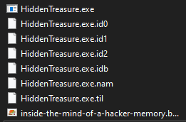
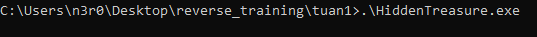
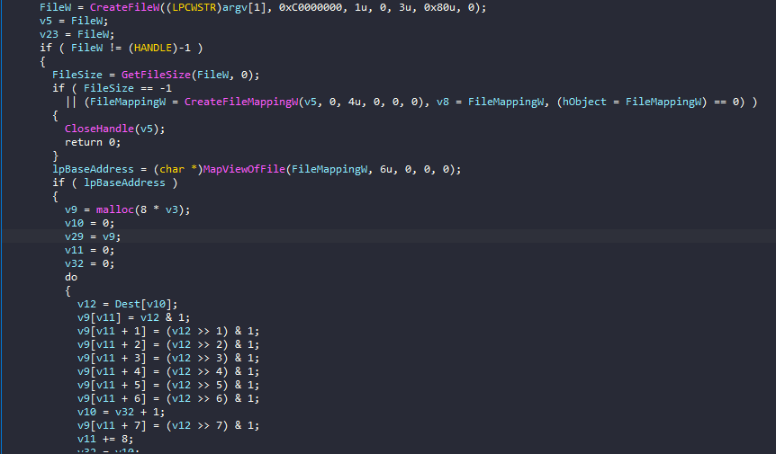
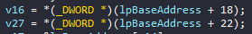
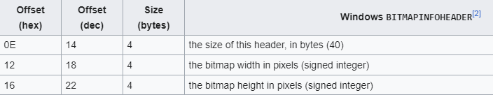
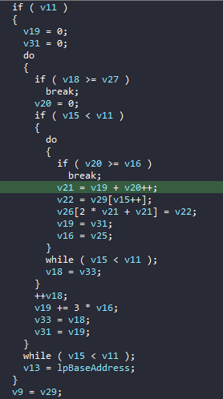
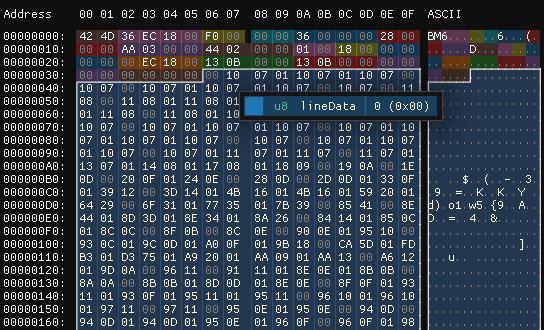
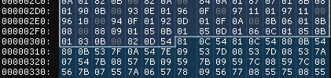
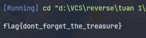

# HiddenTreasure

Ta có 2 file `.exe` và `.bmp`. <br>

<br>

Chạy thử chương trình thì không thấy gì xảy ra, thả vào IDA để reverse. <br>

<br>

Main chương trình:
```c
int __cdecl main(int argc, const char **argv, const char **envp)
{
  unsigned int v3; // kr00_4
  HANDLE FileW; // eax
  void *v5; // ebx
  HANDLE FileMappingW; // eax
  void *v8; // esi
  _BYTE *v9; // ebx
  unsigned int v10; // eax
  unsigned int v11; // esi
  char v12; // cl
  const void *v13; // edi
  DWORD v14; // edx
  unsigned int v15; // ebx
  int v16; // ecx
  char *v17; // eax
  int v18; // edx
  int v19; // eax
  int v20; // edi
  int v21; // edx
  char v22; // al
  HANDLE v23; // [esp+4h] [ebp-128h]
  HANDLE hObject; // [esp+8h] [ebp-124h]
  int v25; // [esp+Ch] [ebp-120h]
  char *v26; // [esp+10h] [ebp-11Ch]
  int v27; // [esp+14h] [ebp-118h]
  char *lpBaseAddress; // [esp+18h] [ebp-114h]
  _BYTE *v29; // [esp+1Ch] [ebp-110h]
  DWORD FileSize; // [esp+20h] [ebp-10Ch]
  int v31; // [esp+20h] [ebp-10Ch]
  unsigned int v32; // [esp+24h] [ebp-108h]
  int v33; // [esp+24h] [ebp-108h]
  char Dest[256]; // [esp+28h] [ebp-104h] BYREF

  if ( argc == 3 )
  {
    memset(Dest, 0, sizeof(Dest));
    wcstombs(Dest, (const wchar_t *)argv[2], 0x100u);
    v3 = strlen(Dest);
    if ( v3 )
    {
      FileW = CreateFileW((LPCWSTR)argv[1], 0xC0000000, 1u, 0, 3u, 0x80u, 0);
      v5 = FileW;
      v23 = FileW;
      if ( FileW != (HANDLE)-1 )
      {
        FileSize = GetFileSize(FileW, 0);
        if ( FileSize == -1
          || (FileMappingW = CreateFileMappingW(v5, 0, 4u, 0, 0, 0), v8 = FileMappingW, (hObject = FileMappingW) == 0) )
        {
          CloseHandle(v5);
          return 0;
        }
        lpBaseAddress = (char *)MapViewOfFile(FileMappingW, 6u, 0, 0, 0);
        if ( lpBaseAddress )
        {
          v9 = malloc(8 * v3);
          v10 = 0;
          v29 = v9;
          v11 = 0;
          v32 = 0;
          do
          {
            v12 = Dest[v10];
            v9[v11] = v12 & 1;
            v9[v11 + 1] = (v12 >> 1) & 1;
            v9[v11 + 2] = (v12 >> 2) & 1;
            v9[v11 + 3] = (v12 >> 3) & 1;
            v9[v11 + 4] = (v12 >> 4) & 1;
            v9[v11 + 5] = (v12 >> 5) & 1;
            v9[v11 + 6] = (v12 >> 6) & 1;
            v10 = v32 + 1;
            v9[v11 + 7] = (v12 >> 7) & 1;
            v11 += 8;
            v32 = v10;
          }
          while ( v10 < v3 );
          v13 = lpBaseAddress;
          if ( *(_WORD *)lpBaseAddress == 0x4D42 && FileSize >= *(_DWORD *)(lpBaseAddress + 2) )
          {
            v14 = *(_DWORD *)(lpBaseAddress + 10);
            if ( v14 < FileSize && v11 < *(_DWORD *)(lpBaseAddress + 34) )
            {
              v15 = 0;
              v16 = *(_DWORD *)(lpBaseAddress + 18);
              v27 = *(_DWORD *)(lpBaseAddress + 22);
              v17 = &lpBaseAddress[v14];
              v18 = 0;
              v25 = v16;
              v26 = v17;
              *((_WORD *)lpBaseAddress + 3) = v11;
              v33 = 0;
              if ( v11 )
              {
                v19 = 0;
                v31 = 0;
                do
                {
                  if ( v18 >= v27 )
                    break;
                  v20 = 0;
                  if ( v15 < v11 )
                  {
                    do
                    {
                      if ( v20 >= v16 )
                        break;
                      v21 = v19 + v20++;
                      v22 = v29[v15++];
                      v26[2 * v21 + v21] = v22;
                      v19 = v31;
                      v16 = v25;
                    }
                    while ( v15 < v11 );
                    v18 = v33;
                  }
                  ++v18;
                  v19 += 3 * v16;
                  v33 = v18;
                  v31 = v19;
                }
                while ( v15 < v11 );
                v13 = lpBaseAddress;
              }
              v9 = v29;
            }
          }
          free(v9);
          UnmapViewOfFile(v13);
          CloseHandle(hObject);
          CloseHandle(v23);
        }
        else
        {
          CloseHandle(v8);
          CloseHandle(v5);
        }
      }
    }
  }
  return 0;
}
```
Đọc lướt qua mã giả thì nhận thấy chương trình nhận vào 2 tham số: `arg[1]` là string dài tối đa 256 char, `arg[2]` được lưu trong biến `Dest` là đường dẫn tới file `.bmp`. Ta cũng có thể đoán mò được là chương trình lưu flag vào trong file `.bmp`. Giờ cần hiểu cơ chế chương trình để extract flag.

Phân tích kĩ, các bước đầu chỉ lấy file size, mapping vào bộ nhớ và lấy địa chỉ của vùng mapping, lấy chuỗi input và lưu vào mảng. <br>

<br>

Phần đáng quan tâm ở đây:
```c
if ( *(_WORD *)lpBaseAddress == 0x4D42 && FileSize >= *(_DWORD *)(lpBaseAddress + 2) )
          {
            v14 = *(_DWORD *)(lpBaseAddress + 10);
            if ( v14 < FileSize && v11 < *(_DWORD *)(lpBaseAddress + 34) )
            {
              v15 = 0;
              v16 = *(_DWORD *)(lpBaseAddress + 18);
              v27 = *(_DWORD *)(lpBaseAddress + 22);
              v17 = &lpBaseAddress[v14];
              v18 = 0;
              v25 = v16;
              v26 = v17;
              *((_WORD *)lpBaseAddress + 3) = v11;
              v33 = 0;
              if ( v11 )
              {
                v19 = 0;
                v31 = 0;
                do
                {
                  if ( v18 >= v27 )
                    break;
                  v20 = 0;
                  if ( v15 < v11 )
                  {
                    do
                    {
                      if ( v20 >= v16 )
                        break;
                      v21 = v19 + v20++;
                      v22 = v29[v15++];
                      v26[2 * v21 + v21] = v22;
                      v19 = v31;
                      v16 = v25;
                    }
                    while ( v15 < v11 );
                    v18 = v33;
                  }
                  ++v18;
                  v19 += 3 * v16;
                  v33 = v18;
                  v31 = v19;
                }
                while ( v15 < v11 );
                v13 = lpBaseAddress;
              }
              v9 = v29;
            }
          }
```
Đoạn này chương trình sẽ check header của file xem của phải là bitmap không(0x4D42), đồng thời thực hiện 1 vài so sánh với `FileSize`.
Bên trong đoạn `if` statement có lưu 1 số thông tin khác về file, đối chiểu theo [BMP file format](https://en.wikipedia.org/wiki/BMP_file_format), ta biết được:
- `v16` lưu chiều rộng file bitmap
- `v27` lưu chiều dài file bitmap
<br>


<br>


<br>

Đoạn này code hơi rối, do mình không biết debug như nào khúc này nên chúng ta sẽ skim read và giả định chức năng vậy :D. <br>

<br>
Có vẻ như đoạn này sẽ thao tác thêm các byte từ string vào file bitmap.

Inspect hex của file bitmap: <br>

<br>
Field data là field được chương trình ghi vào, và có 1 quy luật: mỗi 3 byte sẽ xuất hiện byte `00` hoặc `01`.

Đến offset 306 là quy luật chấm dứt. <br>

<br>
Giờ thì tính độ dài string:

> 0x306 - 0x36 = 720
> 
> 720 / 3 = 240
>
> 240 / 8 = 30
 
Vậy là flag dài 30 char.

Solve script như sau:
```c
#include <stdio.h>

unsigned char raw_data[720] = {
	0x00, 0x10, 0x07, 0x01, 0x10, 0x07, 0x01, 0x10, 0x07, 0x00, 0x10, 0x07,
	0x00, 0x10, 0x07, 0x01, 0x10, 0x07, 0x01, 0x10, 0x07, 0x00, 0x10, 0x07,
	0x00, 0x11, 0x08, 0x00, 0x11, 0x08, 0x01, 0x11, 0x08, 0x01, 0x11, 0x08,
	0x00, 0x11, 0x08, 0x01, 0x11, 0x08, 0x01, 0x11, 0x08, 0x00, 0x11, 0x08,
	0x01, 0x10, 0x07, 0x00, 0x10, 0x07, 0x00, 0x10, 0x07, 0x00, 0x10, 0x07,
	0x00, 0x10, 0x07, 0x01, 0x10, 0x07, 0x01, 0x10, 0x07, 0x00, 0x10, 0x07,
	0x01, 0x10, 0x07, 0x01, 0x10, 0x07, 0x01, 0x10, 0x07, 0x00, 0x10, 0x07,
	0x00, 0x10, 0x07, 0x01, 0x10, 0x07, 0x01, 0x10, 0x07, 0x00, 0x10, 0x07,
	0x01, 0x11, 0x07, 0x01, 0x11, 0x07, 0x00, 0x11, 0x07, 0x01, 0x13, 0x07,
	0x01, 0x14, 0x08, 0x01, 0x17, 0x08, 0x01, 0x18, 0x09, 0x00, 0x19, 0x0A,
	0x00, 0x1E, 0x0D, 0x00, 0x20, 0x0F, 0x01, 0x24, 0x0E, 0x00, 0x28, 0x0D,
	0x00, 0x2D, 0x0D, 0x01, 0x33, 0x0F, 0x01, 0x39, 0x12, 0x00, 0x3D, 0x14,
	0x01, 0x4B, 0x16, 0x01, 0x4B, 0x16, 0x01, 0x59, 0x20, 0x01, 0x64, 0x29,
	0x00, 0x6F, 0x31, 0x01, 0x77, 0x35, 0x01, 0x7B, 0x39, 0x00, 0x85, 0x41,
	0x00, 0x8E, 0x44, 0x01, 0x8D, 0x3D, 0x01, 0x8E, 0x34, 0x01, 0x8A, 0x26,
	0x00, 0x84, 0x14, 0x01, 0x85, 0x0C, 0x01, 0x8C, 0x0C, 0x00, 0x8F, 0x0B,
	0x00, 0x8C, 0x0E, 0x00, 0x90, 0x0E, 0x01, 0x95, 0x10, 0x00, 0x93, 0x0C,
	0x01, 0x9C, 0x0D, 0x01, 0xA0, 0x0F, 0x01, 0x9B, 0x18, 0x00, 0xCA, 0x5D,
	0x01, 0xFD, 0xB3, 0x01, 0xD3, 0x75, 0x01, 0xA9, 0x20, 0x01, 0xAA, 0x09,
	0x01, 0xAA, 0x13, 0x00, 0xA6, 0x12, 0x01, 0x9D, 0x0A, 0x00, 0x96, 0x11,
	0x00, 0x91, 0x11, 0x01, 0x8E, 0x0E, 0x01, 0x8B, 0x0B, 0x00, 0x8A, 0x0A,
	0x00, 0x8B, 0x0B, 0x01, 0x8D, 0x0D, 0x01, 0x8E, 0x0E, 0x00, 0x8F, 0x0F,
	0x01, 0x93, 0x11, 0x01, 0x93, 0x0F, 0x01, 0x95, 0x11, 0x01, 0x95, 0x11,
	0x00, 0x96, 0x10, 0x01, 0x96, 0x10, 0x01, 0x97, 0x11, 0x00, 0x97, 0x11,
	0x00, 0x95, 0x0E, 0x01, 0x95, 0x0E, 0x00, 0x94, 0x0D, 0x00, 0x94, 0x0D,
	0x01, 0x94, 0x0D, 0x01, 0x95, 0x0E, 0x01, 0x96, 0x0F, 0x00, 0x96, 0x0F,
	0x01, 0x98, 0x0E, 0x01, 0x98, 0x0E, 0x01, 0x99, 0x0F, 0x00, 0x9E, 0x13,
	0x00, 0xA0, 0x15, 0x01, 0xA3, 0x17, 0x01, 0xA5, 0x19, 0x00, 0xA8, 0x1B,
	0x01, 0xB3, 0x26, 0x00, 0xB6, 0x28, 0x01, 0xB7, 0x28, 0x00, 0xB8, 0x29,
	0x00, 0xB8, 0x28, 0x01, 0xBB, 0x2B, 0x01, 0xBE, 0x2C, 0x00, 0xB4, 0x22,
	0x00, 0xAE, 0x23, 0x00, 0xC0, 0x37, 0x01, 0xAA, 0x20, 0x00, 0x97, 0x0E,
	0x01, 0x8D, 0x09, 0x01, 0x97, 0x14, 0x01, 0x90, 0x0F, 0x00, 0x8C, 0x0B,
	0x01, 0x96, 0x15, 0x01, 0x8B, 0x11, 0x01, 0x8D, 0x15, 0x01, 0x85, 0x0D,
	0x01, 0x80, 0x0A, 0x00, 0x78, 0x07, 0x01, 0x78, 0x0A, 0x00, 0x7A, 0x0B,
	0x00, 0x76, 0x0E, 0x00, 0x77, 0x0E, 0x01, 0x76, 0x0D, 0x00, 0x74, 0x0B,
	0x01, 0x72, 0x09, 0x01, 0x71, 0x08, 0x01, 0x71, 0x09, 0x00, 0x72, 0x0A,
	0x00, 0x77, 0x09, 0x00, 0x77, 0x09, 0x00, 0x79, 0x09, 0x01, 0x79, 0x09,
	0x00, 0x79, 0x09, 0x01, 0x7B, 0x08, 0x01, 0x7C, 0x09, 0x00, 0x7D, 0x0A,
	0x01, 0x7E, 0x0B, 0x00, 0x7F, 0x0C, 0x01, 0x7F, 0x0C, 0x00, 0x80, 0x0B,
	0x00, 0x80, 0x0B, 0x01, 0x80, 0x0B, 0x01, 0x81, 0x0A, 0x00, 0x82, 0x0B,
	0x01, 0x84, 0x0B, 0x01, 0x85, 0x0C, 0x01, 0x85, 0x0C, 0x01, 0x86, 0x0D,
	0x01, 0x86, 0x0D, 0x00, 0x86, 0x0D, 0x01, 0x86, 0x0D, 0x00, 0x86, 0x0D,
	0x00, 0x86, 0x0C, 0x00, 0x86, 0x0C, 0x01, 0x87, 0x0D, 0x00, 0x87, 0x0C,
	0x01, 0x87, 0x0C, 0x01, 0x86, 0x0B, 0x01, 0x85, 0x0A, 0x00, 0x85, 0x0A,
	0x00, 0x83, 0x0A, 0x01, 0x83, 0x0A, 0x00, 0x83, 0x0A, 0x00, 0x83, 0x0A,
	0x01, 0x83, 0x0A, 0x01, 0x83, 0x0A, 0x01, 0x83, 0x0A, 0x00, 0x83, 0x0A,
	0x01, 0x84, 0x0B, 0x00, 0x85, 0x0C, 0x01, 0x85, 0x0C, 0x00, 0x84, 0x0B,
	0x00, 0x83, 0x0A, 0x01, 0x82, 0x09, 0x01, 0x81, 0x08, 0x00, 0x82, 0x09,
	0x01, 0x80, 0x07, 0x00, 0x82, 0x09, 0x00, 0x82, 0x09, 0x00, 0x80, 0x09,
	0x00, 0x80, 0x09, 0x01, 0x82, 0x0B, 0x01, 0x82, 0x0B, 0x00, 0x81, 0x0A,
	0x01, 0x82, 0x0A, 0x01, 0x81, 0x0A, 0x00, 0x80, 0x0A, 0x00, 0x7F, 0x09,
	0x01, 0x7F, 0x08, 0x01, 0x7E, 0x07, 0x01, 0x7D, 0x07, 0x00, 0x7C, 0x06,
	0x01, 0x7B, 0x05, 0x00, 0x7B, 0x07, 0x01, 0x7B, 0x07, 0x00, 0x7C, 0x08,
	0x01, 0x7D, 0x09, 0x01, 0x7D, 0x0A, 0x01, 0x7F, 0x09, 0x00, 0x80, 0x08,
	0x00, 0x81, 0x0A, 0x01, 0x82, 0x0B, 0x00, 0x82, 0x0A, 0x00, 0x84, 0x0A,
	0x01, 0x87, 0x07, 0x01, 0x8B, 0x08, 0x01, 0x90, 0x0B, 0x00, 0x93, 0x0E,
	0x01, 0x96, 0x0F, 0x00, 0x97, 0x11, 0x01, 0x97, 0x11, 0x00, 0x96, 0x10,
	0x00, 0x94, 0x0F, 0x01, 0x92, 0x0D, 0x01, 0x8F, 0x0A, 0x00, 0x8B, 0x06,
	0x01, 0x8B, 0x08, 0x00, 0x88, 0x09, 0x01, 0x85, 0x0B, 0x01, 0x85, 0x0D,
	0x01, 0x86, 0x0C, 0x01, 0x85, 0x0B, 0x01, 0x83, 0x0B, 0x00, 0x82, 0x0D
};

int main() {
	char flag[31];
	for (int i = 0; i < 720; i += 24) {
		int a = raw_data[i] + 2 * raw_data[i + 3] + 4 * raw_data[i + 6] + 8 * raw_data[i + 9] + 16 * raw_data[i + 12] + 32 * raw_data[i + 15] + 64 * raw_data[i + 18] + 128 * raw_data[i + 21];
		int j = i / 24;
		flag[j] = a;
	}

	flag[30] = '\0';
    
	printf("\n%s\n", flag);
	return 0;
}
```
Vậy là giả thuyết đã đúng, Q.E.D
Flag: `flag{dont_forget_the_treasure}`. <br>

