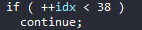

# anti_debug1

Chương trình yêu cầu chạy dưới quyền administrator, giao diện như dưới đây:

Có vẻ như chương trình nhận 1 string đầu vào, và nếu check đúng thì chúng ta sẽ có flag hay gì đấy :D

Trước khi reverse, ta kiểm tra các thuộc tính của chương trình trước, sử dụng CFF Explorer.

Chương trình viết bằng C++, không có packer, hoàn toàn là chương trình C++ điển hình.

Tiến hành reverse chương trình, kiểm tra trong tab `Import`:

Chương trình có sử dụng `IsDebuggerPresent`.

Ta cùng xem hàm `main`.

