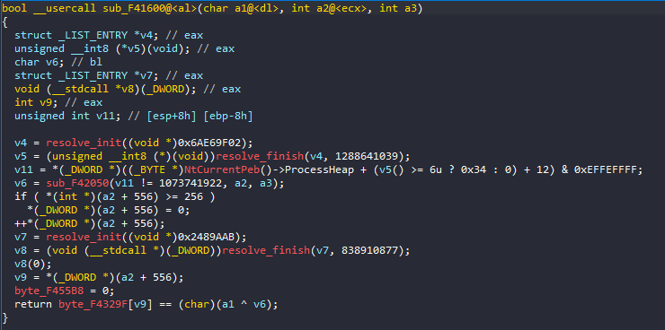
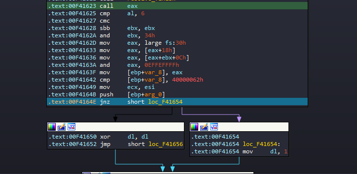

# anti_debug1

Chương trình yêu cầu chạy dưới quyền administrator, giao diện như dưới đây:


Có vẻ như chương trình nhận 1 string đầu vào, và nếu check đúng thì chúng ta sẽ có flag hay gì đấy :D


Trước khi reverse, ta kiểm tra các thuộc tính của chương trình trước, sử dụng CFF Explorer.

Chương trình viết bằng C++, không có packer.

Decompile bằng IDA, nhận thấy có sự xuất hiện của `TLSCallBack_0`. Theo như các cao thủ truyền lại thì nên phân tích con hàng này trước, nó sẽ được run trước `WinMain`([source](https://unprotect.it/technique/tls-callback)). <br>

<br>

Trong function này có gọi tới `sub_F41DF0` và `sub_F41F10` khá sú. <br>

<br>

Đặt breakpoint tại vị trí sau 2 function này và run. <br>
 
<br>
Ta thấy được `NtQueryInformationProcess` được gọi trên stack. Tức là function này được dùng để detect debug.
<br>


<br>
Rename lại cho 2 con hàng.
<br>

Theo tiếp flow chương trình, nếu phát hiện debug thì thay đổi giá trị tại `unk_F45018 + 10`. <br>

<br>

Ta cùng xem `WinMain`.

```c
int __stdcall WinMain(HINSTANCE hInstance, HINSTANCE hPrevInstance, LPSTR lpCmdLine, int nShowCmd)
{
  HACCEL v4; // esi
  HANDLE CurrentProcess; // eax
  HWND Window; // eax
  HWND v7; // esi
  struct tagMSG Msg; // [esp+8h] [ebp-2Ch] BYREF
  HANDLE TokenHandle; // [esp+24h] [ebp-10h] BYREF
  DWORD ReturnLength; // [esp+28h] [ebp-Ch] BYREF
  HACCEL TokenInformation; // [esp+2Ch] [ebp-8h] BYREF

  v4 = 0;
  TokenHandle = 0;
  CurrentProcess = GetCurrentProcess();
  if ( OpenProcessToken(CurrentProcess, 8u, &TokenHandle) )
  {
    ReturnLength = 4;
    if ( GetTokenInformation(TokenHandle, TokenElevation, &TokenInformation, 4u, &ReturnLength) )
      v4 = TokenInformation;
  }
  if ( TokenHandle )
    CloseHandle(TokenHandle);
  if ( !v4 )
  {
    MessageBoxA(0, "Please run the program with administrator right", "Warning", 0);
    exit(1);
  }
  LoadStringW(hInstance, 0x67u, &WindowName, 100);
  LoadStringW(hInstance, 0x6Du, &ClassName, 100);
  sub_401260(hInstance);
  ::hInstance = hInstance;
  Window = CreateWindowExW(0, &ClassName, &WindowName, 0xCF0000u, 0x80000000, 0, 0x80000000, 0, 0, 0, hInstance, 0);
  v7 = Window;
  if ( !Window )
    return 0;
  ShowWindow(Window, nShowCmd);
  UpdateWindow(v7);
  TokenInformation = LoadAcceleratorsW(hInstance, (LPCWSTR)0x6D);
  while ( GetMessageW(&Msg, 0, 0, 0) )
  {
    if ( !TranslateAcceleratorW(Msg.hwnd, TokenInformation, &Msg) )
    {
      TranslateMessage(&Msg);
      DispatchMessageW(&Msg);
    }
  }
  return Msg.wParam;
}
```

Function cần quan tâm ở đây nhất là `CreateWindowExW`, nó sẽ tạo 1 cửa sổ popup cho các hoạt động chính của chương trình. Phía trên có vài chỗ thao tác với `hInstance`, tham số được sử dụng bởi `CreateWindowExW`.

```c
  LoadStringW(hInstance, 0x67u, &WindowName, 100);
  LoadStringW(hInstance, 0x6Du, &ClassName, 100);
  sub_401260(hInstance);
```
<br>

Hai function `LoadStringW` chỉ load string bình thường, không có gì đáng chú ý. Ta nhìn vào `sub_401260`.

```c
ATOM __thiscall sub_401260(HINSTANCE hInstance)
{
  WNDCLASSEXW v2; // [esp+0h] [ebp-34h] BYREF

  v2.cbSize = 48;
  v2.style = 3;
  v2.lpfnWndProc = sub_401350;
  v2.cbClsExtra = 0;
  v2.cbWndExtra = 0;
  v2.hInstance = hInstance;
  v2.hIcon = LoadIconW(hInstance, (LPCWSTR)0x6B);
  v2.hCursor = LoadCursorW(0, (LPCWSTR)0x7F00);
  v2.hbrBackground = (HBRUSH)6;
  v2.lpszMenuName = (LPCWSTR)109;
  v2.lpszClassName = &ClassName;
  v2.hIconSm = LoadIconW(v2.hInstance, (LPCWSTR)0x6C);
  return RegisterClassExW(&v2);
}
```
Function này dùng để đăng ký 1 window class mới, sử dụng `RegisterClassExW`. Nhìn vào `v2.lpfnWndProc` được gán cho `sub_401350`, ta vào kiểm tra `sub_401350`.

```c
LRESULT __stdcall sub_401350(HWND hWnd, UINT Msg, WPARAM wParam, LPARAM lParam)
{
  const CHAR *v5; // [esp-Ch] [ebp-258h]
  DWORD pdwDataLen; // [esp+0h] [ebp-24Ch] BYREF
  struct tagPAINTSTRUCT Paint; // [esp+4h] [ebp-248h] BYREF
  __int128 v8[2]; // [esp+44h] [ebp-208h] BYREF
  __int128 v9; // [esp+64h] [ebp-1E8h]
  char v10[208]; // [esp+74h] [ebp-1D8h] BYREF
  CHAR String[260]; // [esp+144h] [ebp-108h] BYREF

  v8[0] = xmmword_4038D0;
  v8[1] = xmmword_4038E0;
  v9 = xmmword_4038F0;
  memset(v10, 0, sizeof(v10));
  pdwDataLen = 48;
  if ( Msg <= 0xF )
  {
    switch ( Msg )
    {
      case 0xFu:
        BeginPaint(hWnd, &Paint);
        EndPaint(hWnd, &Paint);
        return 0;
      case 1u:
        sub_4012F0(hWnd);
        return 0;
      case 2u:
        PostQuitMessage(0);
        return 0;
    }
    return DefWindowProcW(hWnd, Msg, wParam, lParam);
  }
  if ( Msg != 273 )
    return DefWindowProcW(hWnd, Msg, wParam, lParam);
  switch ( (unsigned __int16)wParam )
  {
    case 4u:
      GetWindowTextA(::hWnd, String, 256);
      if ( (unsigned __int8)sub_401B40(String) )
      {
        sub_401000((BYTE *)String, &pdwDataLen);
        if ( pdwDataLen >= 0x2E )
        {
          BYTE14(v9) = 0;
          MessageBoxA(0, (LPCSTR)v8, "OK", 0);
          return 0;
        }
        v5 = "Wrong";
      }
      else
      {
        v5 = "Wrong check fail";
      }
      MessageBoxA(0, "oh, no", v5, 0);
      return 0;
    case 0x68u:
      DialogBoxParamW(hInstance, (LPCWSTR)0x67, hWnd, DialogFunc, 0);
      return 0;
    case 0x69u:
      DestroyWindow(hWnd);
      return 0;
    default:
      return DefWindowProcW(hWnd, 0x111u, wParam, lParam);
  }
}
```

Lướt qua đoạn code, ta thấy đáng chú ý nhất là đoạn switch case này:
```c
switch ( (unsigned __int16)wParam )
  {
    case 4u:
      GetWindowTextA(::hWnd, String, 256);
      if ( (unsigned __int8)sub_401B40(String) )
      {
        sub_401000((BYTE *)String, &pdwDataLen);
        if ( pdwDataLen >= 0x2E )
        {
          BYTE14(v9) = 0;
          MessageBoxA(0, (LPCSTR)v8, "OK", 0);
          return 0;
        }
        v5 = "Wrong";
      }
      else
      {
        v5 = "Wrong check fail";
      }
      MessageBoxA(0, "oh, no", v5, 0);
      return 0;
    case 0x68u:
      DialogBoxParamW(hInstance, (LPCWSTR)0x67, hWnd, DialogFunc, 0);
      return 0;
    case 0x69u:
      DestroyWindow(hWnd);
      return 0;
    default:
      return DefWindowProcW(hWnd, 0x111u, wParam, lParam);
  }
```
Tại case 4u là phần check input vào, lấy input bằng `GetWindowTextA(::hWnd, String, 256)`, tiếp theo là `if ( (unsigned __int8)sub_401B40(String) )` để check input. Ta xem tiếp `sub_401B40`.
```c
char __thiscall sub_401B40(const char *this)
{
  char v2; // cl
  int v3; // esi
  int v4; // ecx
  char v5; // bl
  char v6; // cl
  int v7; // eax
  char v8; // al
  int v9; // eax
  void (__stdcall *v10)(_DWORD); // eax
  char result; // al
  char v12; // bl
  int v13; // eax
  unsigned __int8 v14; // cl
  int v15; // eax
  int v16; // eax
  void (__stdcall *v17)(_DWORD); // eax
  void (__stdcall *v18)(_DWORD, _DWORD, _DWORD, _DWORD, _DWORD); // [esp-4h] [ebp-25Ch] BYREF
  void (__stdcall *v19)(_DWORD, _DWORD, _DWORD, _DWORD, _DWORD); // [esp+10h] [ebp-248h]
  int v20; // [esp+14h] [ebp-244h]
  void (__stdcall *v21)(_DWORD, _DWORD, _DWORD, _DWORD, _DWORD); // [esp+18h] [ebp-240h]
  char v22; // [esp+1Fh] [ebp-239h]
  char v23[556]; // [esp+20h] [ebp-238h] BYREF
  int v24; // [esp+24Ch] [ebp-Ch]

  if ( strlen(this) < 0x26 )
    return 0;
  sub_401FD0(v23, byte_40501C[(unsigned __int8)byte_40501C[0] / 0xCu]);
  v2 = v22;
  v3 = 0;
  while ( 2 )
  {
    switch ( dword_4032C8[v3] )
    {
      case 1:
        v4 = dword_403360[v3];
        v5 = this[dword_4033F8[v3]];
        v22 = NtCurrentPeb()->NtGlobalFlag & 0x70;
        v6 = sub_402050(v4);
        v7 = v24;
        if ( v24 >= 256 )
          v7 = 0;
        v24 = v7 + 1;
        v2 = byte_40329F[v7 + 1] == (char)(v5 ^ v6);
        goto LABEL_9;
      case 2:
        v8 = sub_401600(dword_403360[v3]);
        goto LABEL_8;
      case 3:
        v8 = sub_4016C0(dword_403360[v3]);
        goto LABEL_8;
      case 4:
        v8 = sub_401760(dword_403360[v3]);
        goto LABEL_8;
      case 5:
        v8 = sub_401950(dword_403360[v3]);
        goto LABEL_8;
      case 6:
        v8 = sub_401AA0(dword_403360[v3]);
LABEL_8:
        v2 = v8;
        goto LABEL_9;
      case 7:
        v20 = dword_403360[v3];
        v12 = this[dword_4033F8[v3]];
        v13 = sub_401DF0(2067767744);
        v19 = (void (__stdcall *)(_DWORD, _DWORD, _DWORD, _DWORD, _DWORD))sub_401F10(v13, 1513862064);
        v21 = 0;
        v18 = v19;
        v19(-1, 31, &v18, 4, 0);
        v21 = v18;
        v14 = sub_402050(v20);
        v15 = v24;
        if ( v24 >= 256 )
          v15 = 0;
        v24 = v15 + 1;
        if ( byte_40329F[v15 + 1] != (v14 ^ (unsigned __int8)v12) )
          goto LABEL_20;
        v2 = 1;
        goto LABEL_10;
      default:
LABEL_9:
        if ( !v2 )
        {
LABEL_20:
          v16 = sub_401DF0(38312619);
          v17 = (void (__stdcall *)(_DWORD))sub_401F10(v16, 838910877);
          v17(0);
          byte_4055B8 = 0;
          return 0;
        }
LABEL_10:
        if ( ++v3 < 38 )
          continue;
        v9 = sub_401DF0(38312619);
        v10 = (void (__stdcall *)(_DWORD))sub_401F10(v9, 838910877);
        v10(0);
        byte_4055B8 = 0;
        result = 1;
        break;
    }
    return result;
  }
}
```

Các chức năng function như sau:

Nếu string input ngắn hơn 38 kí tự thì return false.
```c
if ( strlen(this) < 0x26 )
    return 0;
```
<br>

Đổi tên các biến lại cho dễ đọc hơn. Phía dưới là 1 loop 37 lần. <br>

<br>


Cùng với đó switch case với 7 case, array `dword_4032C8` chứa random số thứ tự các case. 
```c
char __thiscall check_input(const char *input)
{
  char v2; // cl
  int idx; // esi
  int v4; // ecx
  char v5; // bl
  char v6; // cl
  int v7; // eax
  char v8; // al
  struct _LIST_ENTRY *v9; // eax
  void (__stdcall *v10)(_DWORD); // eax
  char result; // al
  char v12; // bl
  struct _LIST_ENTRY *v13; // eax
  bool v14; // zf
  char v15; // dl
  char v16; // cl
  int v17; // eax
  struct _LIST_ENTRY *v18; // eax
  void (__stdcall *v19)(_DWORD); // eax
  void (__stdcall *v20)(_DWORD, _DWORD, _DWORD, _DWORD, _DWORD); // [esp-4h] [ebp-25Ch] BYREF
  void (__stdcall *v21)(_DWORD, _DWORD, _DWORD, _DWORD, _DWORD); // [esp+10h] [ebp-248h]
  void (__stdcall *v22)(_DWORD, _DWORD, _DWORD, _DWORD, _DWORD); // [esp+14h] [ebp-244h]
  void (__stdcall *v23)(_DWORD, _DWORD, _DWORD, _DWORD, _DWORD); // [esp+18h] [ebp-240h]
  char v24; // [esp+1Fh] [ebp-239h]
  char array1[556]; // [esp+20h] [ebp-238h] BYREF
  int v26; // [esp+24Ch] [ebp-Ch]

  if ( strlen(input) < 0x26 )
    return 0;
  sub_F41FD0((__m128i *)array1, byte_F4501C[(unsigned __int8)byte_F4501C[0] / 0xCu]);
  v2 = v24;
  idx = 0;
  while ( 2 )
  {
    switch ( cases[idx] )
    {
      case 1:
        v4 = array2[idx];
        v5 = input[index_array[idx]];
        v24 = NtCurrentPeb()->NtGlobalFlag & 0x70;
        v6 = sub_F42050(v24 == 0x70, (int)array1, v4);
        v7 = v26;
        if ( v26 >= 256 )
          v7 = 0;
        v26 = v7 + 1;
        v2 = byte_F4329F[v7 + 1] == (char)(v5 ^ v6);
        goto LABEL_9;
      case 2:
        v8 = sub_F41600(input[index_array[idx]], (int)array1, array2[idx]);
        goto LABEL_8;
      case 3:
        v8 = sub_F416C0(input[index_array[idx]], (int)array1, array2[idx]);
        goto LABEL_8;
      case 4:
        v8 = sub_F41760(input[index_array[idx]], (int)array1, array2[idx]);
        goto LABEL_8;
      case 5:
        v8 = sub_F41950(array2[idx]);
        goto LABEL_8;
      case 6:
        v8 = sub_F41AA0(array2[idx]);
LABEL_8:
        v2 = v8;
        goto LABEL_9;
      case 7:
        v22 = (void (__stdcall *)(_DWORD, _DWORD, _DWORD, _DWORD, _DWORD))array2[idx];
        v12 = input[index_array[idx]];
        v13 = sub_F41DF0((void *)0x7B3FA1C0);
        v21 = (void (__stdcall *)(_DWORD, _DWORD, _DWORD, _DWORD, _DWORD))sub_F41F10(v13, 1513862064);
        v23 = 0;
        v20 = v21;
        v21(-1, 31, &v20, 4, 0);
        v23 = v20;
        v14 = v20 == 0;
        v20 = v22;
        v15 = !v14;
        v16 = sub_F42050(v15, (int)array1, (int)v20);
        v17 = v26;
        if ( v26 >= 256 )
          v17 = 0;
        v26 = v17 + 1;
        if ( byte_F4329F[v17 + 1] != ((unsigned __int8)v16 ^ (unsigned __int8)v12) )
          goto LABEL_23;
        v2 = 1;
        goto LABEL_10;
      default:
LABEL_9:
        if ( !v2 )
        {
LABEL_23:
          v18 = sub_F41DF0((void *)0x2489AAB);
          v19 = (void (__stdcall *)(_DWORD))sub_F41F10(v18, 838910877);
          v19(0);
          byte_F455B8 = 0;
          return 0;
        }
LABEL_10:
        if ( ++idx < 38 )
          continue;
        v9 = sub_F41DF0((void *)0x2489AAB);
        v10 = (void (__stdcall *)(_DWORD))sub_F41F10(v9, 838910877);
        v10(0);
        byte_F455B8 = 0;
        result = 1;
        break;
    }
    return result;
  }
}
```

### Case 1
```c
case 1:
        v4 = array2[idx];
        v5 = input[index_array[idx]];
        v24 = NtCurrentPeb()->NtGlobalFlag & 0x70;
        v6 = sub_F42050(v24 == 0x70, (int)array1, v4);
        v7 = v26;
        if ( v26 >= 256 )
          v7 = 0;
        v26 = v7 + 1;
        v2 = byte_F4329F[v7 + 1] == (char)(v5 ^ v6);
```
Đoạn này sử dụng `NtGlobalFlag`([source](https://anti-debug.checkpoint.com/techniques/debug-flags.html#manual-checks-ntglobalflag)), lưu vào `v24` so sánh với `0x70`, đồng nghĩa với raise cả 3 flag(0x10, 0x20, 0x40) và return 1. `v24` là argument thứ 1 của `sub_F42050`. <br>

<br>

 `sub_F42050` còn 2 arguments khác là `array1` và 1 phần tử của `array2`, return về char sau đó XOR với input để so sánh với `byte_F4329F[v7 + 1]`.

 Để giải mã, ta cần sửa argument 1 thành 0.

 ### Case 2 <br>
 
 <br>

 
 <br>

 
 <br>
Tại đây ta gặp 2 function `resolve_init` và `resolve_finish` lúc đầu.

Set breakpoint sau 2 function kia và debug, ta được: 


Kết luận được là chương trình sẽ lấy Heap Flags dựa trên version từ `GetVersion`, trong trường hợp này là `Flags` - `40000062h`([source](https://unprotect.it/technique/heap-flag)).



Tiếp tục debug thì chương trình sẽ chạy tới case bên trái, để được kết quả đúng thì ta chọn case bên phải, cho argument 1 = 1.

### Case 3
Tương tự case 2, nhưng sử dụng `ForceFlags`. <br>

<br>


<br>

Luồng chạy case này tương tự case 2, cho argument 1 = 1.

### Case 4
Đoạn này thực hiện 1 loạt init resolve và finish.


Thực hiện debug chương trình, ta kết luận luồng không phát hiện debug là 0, còn lại là 1, case này sẽ set argument 1 là 0.

### Case 5
Debug phát hiện ra sử dụng `CreateToolhelp32Snapshot` để check debugger tồn tại hay không.


Đặt breakpoint tại 2 vị trí return 0 và 1, sau đó F9 để quan sát chương trình trả về.

Vì 1 lí do nào đó mà chúng ta bypass được phần check debugger, và chương trình dừng tại vị trí return 0. 


Luồng không có debugger là 0.

### Case 6


Sau khi chạy qua 2 function resolve, phát hiện sử dụng `BlockInput` nếu detect debugger.

```c
bool __usercall sub_F41AA0@<al>(char a1@<dl>, int a2@<ecx>, int a3)
{
  struct _LIST_ENTRY *v5; // eax
  int (__stdcall *v6)(int); // esi
  char v7; // bl
  char v8; // al
  char v9; // al

  v5 = resolve_init(&unk_2489AAB);
  v6 = (int (__stdcall *)(int))resolve_finish(v5, 838910877);
  v7 = v6(1);
  v8 = v6(1);
  if ( byte_F455B8 )
  {
    if ( v7 == v8 )
      goto LABEL_3;
  }
  else if ( v7 != v8 )
  {
LABEL_3:
    v9 = sub_F42050(a3);
    byte_F455B8 = 1;
    goto LABEL_6;
  }
  v9 = sub_F42050(a3);
LABEL_6:
  if ( *(int *)(a2 + 556) >= 256 )
    *(_DWORD *)(a2 + 556) = 0;
  ++*(_DWORD *)(a2 + 556);
  return byte_F4329F[*(_DWORD *)(a2 + 556)] == (char)(a1 ^ v9);
}
```

Case này gán cả v7, v8 == v6 chính là hàm `BlockInput` để check xem chương trình có đang bị debug hay ko, nếu phát hiện debug thì sẽ jmp dến `LABEL_3` vì thế để bypass ta sẽ đổi lại argument ở v9 là 1.

### Case 7


Phần này lại sử dụng `NtQueryInformationProcess`


Debug 1 hồi thì chúng ta return 0, vậy cho argument 1 = 1 là oke.

### Solve
```c
#include <stdio.h>
#include <stdbool.h>

#define _WORD unsigned __int16
#define _DWORD unsigned __int32

char sub_F42050(char a1, unsigned __int8 *a2, int a3)
{
    int v4;               // esi
    char v6;              // bl
    int v7;               // ecx
    unsigned __int16 v8;  // dx
    unsigned int v9;      // edx
    char v10;             // cl
    unsigned int v11;     // edx
    unsigned __int8 v12;  // al
    bool v13;             // zf
    unsigned __int8 *v14; // ecx
    int v15;              // esi
    char v16;             // dl
    int v18;              // [esp+14h] [ebp+8h]

    v4 = a3 - 1;
    v18 = 171;
    v6 = 0;
    do
    {
        if (v4 <= 5)
        {
            if (*(_DWORD *)&a2[4 * v4 + 16])
                v8 = *(_WORD *)&a2[4 * v4 + 16];
            else
                v8 = *(_WORD *)&a2[4 * v4];
            v7 = (v8 >> 1) | (unsigned __int16)(((unsigned __int16)(32 * v8) ^ (v8 ^ (unsigned __int16)(4 * (v8 ^ (2 * v8)))) & 0xFFE0) << 10);
            *(_DWORD *)&a2[4 * v4 + 16] = v7;
        }
        else
        {
            v7 = 0;
        }
        v9 = v7 & 0x7FF;
        v10 = v7 & 7;
        v11 = v9 >> 3;
        if (a1)
            v12 = a2[v11 + 44];
        else
            v12 = ~a2[v11 + 44];
        v13 = v18-- == 1;
        a2[v11 + 44] = v12 ^ (1 << v10);
    } while (!v13);
    v14 = a2 + 46;
    v15 = 64;
    do
    {
        v16 = *(v14 - 2);
        v14 += 4;
        v6 ^= *(v14 - 4) ^ *(v14 - 3) ^ *(v14 - 5) ^ v16;
        --v15;
    } while (v15);
    return v6;
}

int main()
{
    unsigned __int32 type[] = {6, 1, 7, 1, 3, 2, 4, 3, 6, 3, 7, 6, 1, 4, 7, 4, 1, 5, 7, 6, 7, 5, 6, 4, 5, 1, 7, 5, 2, 3, 1, 2, 3, 2, 1, 6, 2, 4};
    unsigned __int32 array_2[] = {1, 3, 1, 1, 2, 1, 3, 1, 2, 2, 4, 4, 1, 3, 4, 4, 4, 1, 2, 1, 4, 1, 4, 3, 1, 2, 4, 4, 2, 2, 1, 3, 4, 2, 1, 2, 2, 3};
    unsigned __int32 index_array[] = {9, 18, 15, 3, 4, 23, 6, 7, 8, 22, 10, 11, 33, 13, 14, 27, 16, 37, 17, 19, 20, 21, 5, 34, 24, 25, 26, 2, 12, 29, 30, 31, 32, 28, 0, 35, 36, 1};
    unsigned __int8 cipher[] = {14, 235, 243, 246, 209, 107, 167, 143, 61, 145, 133, 43, 134, 167, 107, 219, 123, 110, 137, 137, 24, 149, 103, 202, 95, 226, 84, 14, 211, 62, 32, 90, 126, 212, 184, 16, 194, 183};
    unsigned __int8 array_1[] = {54, 236, 0, 0, 54, 237, 0, 0, 54, 187, 0, 0, 54, 140, 0, 0, 0, 0, 0, 0, 0, 0, 0, 0, 0, 0, 0, 0, 0, 0, 0, 0, 95, 0, 0, 0, 188, 240, 96, 0, 25, 190, 72, 117, 0, 0, 0, 0, 0, 0, 0, 0, 0, 0, 0, 0, 0, 0, 0, 0, 0, 0, 0, 0, 0, 0, 0, 0, 0, 0, 0, 0, 0, 0, 0, 0, 0, 0, 0, 0, 0, 0, 0, 0, 0, 0, 0, 0, 0, 0, 0, 0, 0, 0, 0, 0, 0, 0, 0, 0, 0, 0, 0, 0, 0, 0, 0, 0, 0, 0, 0, 0, 0, 0, 0, 0, 0, 0, 0, 0, 0, 0, 0, 0, 0, 0, 0, 0, 0, 0, 0, 0, 0, 0, 0, 0, 0, 0, 0, 0, 0, 0, 0, 0, 0, 0, 0, 0, 0, 0, 0, 0, 0, 0, 0, 0, 0, 0, 0, 0, 0, 0, 0, 0, 0, 0, 0, 0, 0, 0, 0, 0, 0, 0, 0, 0, 0, 0, 0, 0, 0, 0, 0, 0, 0, 0, 0, 0, 0, 0, 0, 0, 0, 0, 0, 0, 0, 0, 0, 0, 0, 0, 0, 0, 0, 0, 0, 0, 0, 0, 0, 0, 0, 0, 0, 0, 0, 0, 0, 0, 0, 0, 0, 0, 0, 0, 0, 0, 0, 0, 0, 0, 0, 0, 0, 0, 0, 0, 0, 0, 0, 0, 0, 0, 0, 0, 0, 0, 0, 0, 0, 0, 0, 0, 0, 0, 0, 0, 0, 0, 0, 0, 0, 0, 0, 0, 0, 0, 0, 0, 0, 0, 0, 0, 0, 0, 0, 0, 0, 0, 0, 0, 0, 0, 0, 0, 0, 0, 0, 0, 0, 0, 0, 0, 0, 0, 0, 0, 0, 0, 0, 0, 0, 0, 0, 0, 0, 0, 0, 0, 0, 0, 0, 0, 0, 0, 0, 0, 0, 0, 0, 0, 0, 0, 0, 0, 0, 0, 0, 0, 0, 0, 0, 0, 0, 0, 0, 0, 0, 0, 0, 0, 0, 0, 0, 0, 0, 0, 0, 0, 0, 0, 0, 0, 0, 0, 0, 0, 0, 0, 0, 0, 0, 0, 0, 0, 0, 0, 0, 0, 0, 0, 0, 0, 0, 0, 0, 0, 0, 0, 0, 0, 0, 0, 0, 0, 0, 0, 0, 0, 0, 0, 0, 0, 0, 0, 0, 0, 0, 0, 0, 0, 0, 0, 0, 0, 0, 0, 0, 0, 0, 0, 0, 0, 0, 0, 0, 0, 0, 0, 0, 0, 0, 0, 0, 0, 0, 0, 0, 0, 0, 0, 0, 0, 0, 0, 0, 0, 0, 0, 0, 0, 0, 0, 0, 0, 0, 0, 0, 0, 0, 0, 0, 0, 0, 0, 0, 0, 0, 0, 0, 0, 0, 0, 0, 0, 0, 0, 0, 0, 0, 0, 0, 0, 0, 0, 0, 0, 0, 0, 0, 0, 0, 0, 0, 0, 0, 0, 0, 0, 0, 0, 0, 0, 0, 0, 0, 0, 0, 0, 0, 0, 0, 0, 0, 0, 0, 0, 0, 0, 0, 0, 0, 0, 0, 0, 0, 0, 0, 0, 0, 0, 0, 0, 0, 0, 0, 0, 0, 0, 0, 0, 0, 0, 0, 0, 0, 0, 0, 0, 0, 0, 0, 0, 0, 0, 0, 0, 0, 0, 0, 0, 0, 0, 0, 0};

    unsigned char tmp;
    unsigned char flag[39];

    for (int i = 0; i < 38; i++)
    {
        switch (type[i])
        {
            case 1:
                tmp = sub_F42050(0, array_1, array_2[i]);
                flag[index_array[i]] = cipher[i] ^ tmp;
                break;
            case 2:
                tmp = sub_F42050(1, array_1, array_2[i]);
                flag[index_array[i]] = cipher[i] ^ tmp;
                break;
            case 3:
                tmp = sub_F42050(1, array_1, array_2[i]);
                flag[index_array[i]] = cipher[i] ^ tmp;
                break;
            case 4:
                tmp = sub_F42050(0, array_1, array_2[i]);
                flag[index_array[i]] = cipher[i] ^ tmp;
                break;
            case 5:
                tmp = sub_F42050(0, array_1, array_2[i]);
                flag[index_array[i]] = cipher[i] ^ tmp;
                break;
            case 6:
                tmp = sub_F42050(1, array_1, array_2[i]);
                flag[index_array[i]] = cipher[i] ^ tmp;
                break;
            case 7:
                tmp = sub_F42050(1, array_1, array_2[i]);
                flag[index_array[i]] = cipher[i] ^ tmp;
                break;
            default:
                break;
        }
    }
    flag[38] = '\0';

    printf("\n%s\n", flag);
    return 0;
}
```

Key:


Flag:


