# crack_me1

Test sơ qua thì đây có vẻ là một chương trình nhập key và check key. <br>
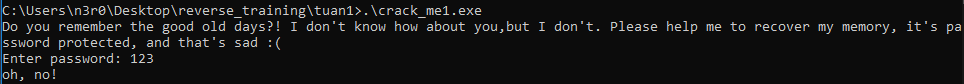

Mở chương trình trong IDA xem mã giả.<br>

Hàm main chương trình như sau: <br>
```c
int __cdecl main(int argc, const char **argv, const char **envp)
{
  char Format[160]; // [esp+8h] [ebp-2C4h] BYREF
  char password; // [esp+A8h] [ebp-224h] BYREF
  char v6[299]; // [esp+A9h] [ebp-223h] BYREF
  char v7[200]; // [esp+1D4h] [ebp-F8h] BYREF
  void *v8; // [esp+29Ch] [ebp-30h]
  int v9; // [esp+2A0h] [ebp-2Ch]
  int v10; // [esp+2A4h] [ebp-28h]
  char *v11; // [esp+2A8h] [ebp-24h]
  int v12; // [esp+2ACh] [ebp-20h]
  char *v13; // [esp+2B0h] [ebp-1Ch]
  int v14; // [esp+2B4h] [ebp-18h]
  int v15; // [esp+2B8h] [ebp-14h]
  char *v16; // [esp+2BCh] [ebp-10h]
  char *p_password; // [esp+2C0h] [ebp-Ch]
  int i; // [esp+2C8h] [ebp-4h]

  password = 0;
  memset(v6, 0, sizeof(v6));
  v9 = 335;
  memset(v7, 0, sizeof(v7));
  strcpy(
    Format,
    "Do you remember the good old days?! I don't know how about you,but I don't. Please help me to recover my memory, it'"
    "s password protected, and that's sad :(\n");
  v8 = &unk_734BE8;
  print(Format);
  print("Enter password: ");
  scanf("%300[^\n]s", &password);
  p_password = &password;
  v13 = v6;
  p_password += strlen(p_password);
  v12 = ++p_password - v6;
  v14 = p_password - v6;
  v16 = &password;
  v11 = v6;
  v16 += strlen(v16);
  v10 = ++v16 - v6;
  if ( (unsigned int)(v16 - v6) >= 0x126 )
  {
    if ( sub_7311D0(&password) )
    {
      v15 = v14 / 3;
      for ( i = 0; i < v14; ++i )
        v7[i % v15] ^= v6[i - 1];
      for ( i = 0; i < v9; ++i )
        flag[i] ^= v7[i % v15];
      print("\n\nCongratulation! Here is your memo :> \n\n");
      print("%s", flag);
    }
    else
    {
      print("\nInvalid password\n");
    }
    getchar();
    getchar();
    return 0;
  }
  else
  {
    print("oh, no!");
    return 0;
  }
}
```

Chương trình cho phép input dài tối đa 300 kí tự. <br>
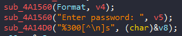
<br>

Sau đó kiểm tra tiếp, nếu input > 294 kí tự thì mới thao tác tiếp. <br>
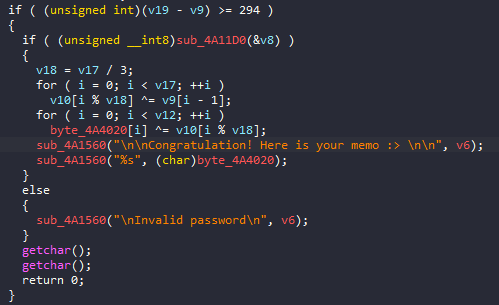
<br>

Sau khi pass check sẽ tới `sub_4A11D0`. <br>
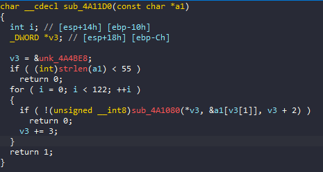


Tại đây input lại được check 1 lần nữa qua `sub_4A1080`. Function này nhận 3 param, param 1 là số thứ tự case, param 2 là vị trí bắt đầu của input để kiểm tra, param 3 là string chương trình đã có sẵn dành cho việc kiểm tra, mỗi param sẽ là 4 byte lấy từ array `&unk_4A4BE8`.

Array `&unk_4A4BE8`:

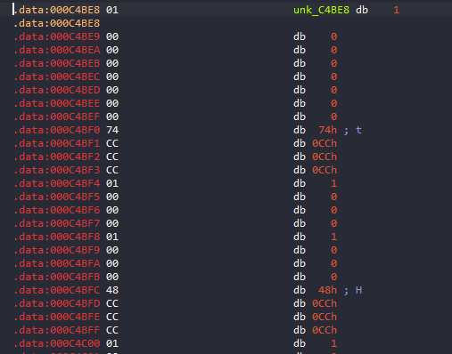

Mỗi case sẽ gồm 12 byte, tức 12 phần tử mảng gộp lại, cấu trúc như sau:

| Số thứ tự case | Vị trí bắt đầu so sánh | String so sánh |
| ----------------------- | ----------------------- | ----------------------- |
| 0x01, 0x00, 0x00, 0x00 | 0x00, 0x00, 0x00, 0x00  | 0x74, 0xCC, 0xCC, 0xCC |

Hàm check:
```c
char __cdecl sub_4A1080(int a1, int a2, int a3)
{
  char v4[4]; // [esp+0h] [ebp-20h] BYREF
  LPVOID v5; // [esp+4h] [ebp-1Ch]
  LPVOID v6; // [esp+8h] [ebp-18h]
  SIZE_T v7; // [esp+Ch] [ebp-14h]
  SIZE_T v8; // [esp+10h] [ebp-10h]
  LPVOID lpAddress; // [esp+14h] [ebp-Ch]
  SIZE_T dwSize; // [esp+18h] [ebp-8h]
  char v11; // [esp+1Fh] [ebp-1h]

  v8 = 221;
  v5 = (LPVOID)sub_4A1000((int)&unk_4A4288, 0xDDu, 5);
  v7 = 278;
  v6 = (LPVOID)sub_4A1000((int)&unk_4A4170, 0x116u, 6);
  if ( !v5 || !v6 )
    return 0;
  switch ( a1 )
  {
    case 1:
      dwSize = 97;
      lpAddress = (LPVOID)sub_4A1000((int)&unk_4A4B80, 0x61u, 1);
      break;
    case 2:
      dwSize = 142;
      lpAddress = (LPVOID)sub_4A1000((int)&unk_4A4AF0, 0x8Eu, 2);
      break;
    case 3:
      dwSize = 1685;
      lpAddress = (LPVOID)sub_4A1000((int)&unk_4A4458, 0x695u, 3);
      break;
    case 4:
      dwSize = 235;
      lpAddress = (LPVOID)sub_4A1000((int)&unk_4A4368, 0xEBu, 4);
      break;
    default:
      return 0;
  }
  if ( !lpAddress )
    return 0;
  v11 = ((int (__cdecl *)(int, int, char *))lpAddress)(a2, a3, v4);
  VirtualFree(lpAddress, dwSize, 0x8000u);
  VirtualFree(v5, v8, 0x8000u);
  VirtualFree(v6, v7, 0x8000u);
  return v11;
}
```

Function này check 4 case như sau:
-  Case 1: 

```
debug047:001F0000 push    ebp
debug047:001F0001 mov     ebp, esp
debug047:001F0003 push    ecx
debug047:001F0004 mov     eax, [ebp+8]
debug047:001F0007 movsx   ecx, byte ptr [eax]
debug047:001F000A and     ecx, 80000001h
debug047:001F0010 jns     short loc_1F0017
debug047:001F0010
debug047:001F0012 dec     ecx
debug047:001F0013 or      ecx, 0FFFFFFFEh
debug047:001F0016 inc     ecx
debug047:001F0016
debug047:001F0017
debug047:001F0017 loc_1F0017:                             ; CODE XREF: debug047:001F0010↑j
debug047:001F0017 mov     [ebp-1], cl
debug047:001F001A movzx   edx, byte ptr [ebp-1]
debug047:001F001E test    edx, edx
debug047:001F0020 jnz     short loc_1F003B
debug047:001F0020
debug047:001F0022 mov     eax, [ebp+8]
debug047:001F0025 movsx   ecx, byte ptr [eax]
debug047:001F0028 xor     ecx, 20h
debug047:001F002B mov     edx, [ebp+0Ch]
debug047:001F002E movzx   eax, byte ptr [edx]
debug047:001F0031 cmp     ecx, eax
debug047:001F0033 jnz     short loc_1F003B
debug047:001F0033
debug047:001F0035 mov     al, 1
debug047:001F0037 jmp     short loc_1F005D
debug047:001F0037
debug047:001F0037 ; ---------------------------------------------------------------------------
debug047:001F0039 db 0EBh
debug047:001F003A db  20h
debug047:001F003B ; ---------------------------------------------------------------------------
debug047:001F003B
debug047:001F003B loc_1F003B:                             ; CODE XREF: debug047:001F0020↑j
debug047:001F003B                                         ; debug047:001F0033↑j
debug047:001F003B movzx   ecx, byte ptr [ebp-1]
debug047:001F003F cmp     ecx, 1
debug047:001F0042 jnz     short loc_1F005B
debug047:001F0042
debug047:001F0044 mov     edx, [ebp+8]
debug047:001F0047 movsx   eax, byte ptr [edx]
debug047:001F004A xor     eax, 52h
debug047:001F004D mov     ecx, [ebp+0Ch]
debug047:001F0050 movzx   edx, byte ptr [ecx]
debug047:001F0053 cmp     eax, edx
debug047:001F0055 jnz     short loc_1F005B
debug047:001F0055
debug047:001F0057 mov     al, 1
debug047:001F0059 jmp     short loc_1F005D
debug047:001F0059
debug047:001F005B ; ---------------------------------------------------------------------------
debug047:001F005B
debug047:001F005B loc_1F005B:                             ; CODE XREF: debug047:001F0042↑j
debug047:001F005B                                         ; debug047:001F0055↑j
debug047:001F005B xor     al, al
debug047:001F005B
debug047:001F005D
debug047:001F005D loc_1F005D:                             ; CODE XREF: debug047:001F0037↑j
debug047:001F005D                                         ; debug047:001F0059↑j
debug047:001F005D mov     esp, ebp
debug047:001F005F pop     ebp
debug047:001F0060 retn
```

Vị trí chẵn sẽ XOR 0x20, vị trí lẻ XOR 0x52, sau khi so sánh = true thì return 1.

- Case 2:

```
debug047:00BE0000 push    ebp
debug047:00BE0001 mov     ebp, esp
debug047:00BE0003 sub     esp, 0Ch
debug047:00BE0006 mov     dword ptr [ebp-0Ch], 0
debug047:00BE000D xor     eax, eax
debug047:00BE000F mov     [ebp-4], ax
debug047:00BE0013 mov     ecx, [ebp+0Ch]
debug047:00BE0016 mov     dx, [ecx]
debug047:00BE0019 mov     [ebp-8], dx
debug047:00BE001D mov     eax, [ebp+8]
debug047:00BE0020 movsx   ecx, byte ptr [eax]
debug047:00BE0023 shl     ecx, 8
debug047:00BE0026 mov     edx, [ebp+8]
debug047:00BE0029 movsx   eax, byte ptr [edx+1]
debug047:00BE002D or      ecx, eax
debug047:00BE002F mov     [ebp-4], cx
debug047:00BE0033 mov     dword ptr [ebp-0Ch], 1
debug047:00BE003A jmp     short loc_BE0045
debug047:00BE003A
debug047:00BE003C ; ---------------------------------------------------------------------------
debug047:00BE003C
debug047:00BE003C loc_BE003C:                             ; CODE XREF: debug047:00BE0076↓j
debug047:00BE003C mov     ecx, [ebp-0Ch]
debug047:00BE003F add     ecx, 1
debug047:00BE0042 mov     [ebp-0Ch], ecx
debug047:00BE0042
debug047:00BE0045
debug047:00BE0045 loc_BE0045:                             ; CODE XREF: debug047:00BE003A↑j
debug047:00BE0045 cmp     dword ptr [ebp-0Ch], 5
debug047:00BE0049 jg      short loc_BE0078
debug047:00BE0049
debug047:00BE004B movzx   edx, word ptr [ebp-4]
debug047:00BE004F mov     ecx, [ebp-0Ch]
debug047:00BE0052 shl     edx, cl
debug047:00BE0054 movzx   eax, word ptr [ebp-4]
debug047:00BE0058 mov     ecx, 10h
debug047:00BE005D sub     ecx, [ebp-0Ch]
debug047:00BE0060 sar     eax, cl
debug047:00BE0062 or      edx, eax
debug047:00BE0064 mov     [ebp-4], dx
debug047:00BE0068 movzx   ecx, word ptr [ebp-4]
debug047:00BE006C xor     ecx, 1693h
debug047:00BE0072 mov     [ebp-4], cx
debug047:00BE0076 jmp     short loc_BE003C
debug047:00BE0076
debug047:00BE0078 ; ---------------------------------------------------------------------------
debug047:00BE0078
debug047:00BE0078 loc_BE0078:                             ; CODE XREF: debug047:00BE0049↑j
debug047:00BE0078 movzx   edx, word ptr [ebp-8]
debug047:00BE007C movzx   eax, word ptr [ebp-4]
debug047:00BE0080 cmp     edx, eax
debug047:00BE0082 jnz     short loc_BE0088
debug047:00BE0082
debug047:00BE0084 mov     al, 1
debug047:00BE0086 jmp     short loc_BE008A
debug047:00BE0086
debug047:00BE0088 ; ---------------------------------------------------------------------------
debug047:00BE0088
debug047:00BE0088 loc_BE0088:                             ; CODE XREF: debug047:00BE0082↑j
debug047:00BE0088 xor     al, al
debug047:00BE0088
debug047:00BE008A
debug047:00BE008A loc_BE008A:                             ; CODE XREF: debug047:00BE0086↑j
debug047:00BE008A mov     esp, ebp
debug047:00BE008C pop     ebp
debug047:00BE008D retn
```

Gọi 2 byte cuối là a và b, sau khi debug ta có mã giả như sau:
```
c = (a << 8) | b
i = 5
while i-- > 0
  tmp = (b << c) | (b >> (16 - c))
  b = tmp ^ 1693
```

- Case 3:
```
debug048:01050000 push    ebp
debug048:01050001 mov     ebp, esp
debug048:01050003 sub     esp, 64h
debug048:01050006 mov     dword ptr [ebp-0Ch], 0
debug048:0105000D mov     dword ptr [ebp-10h], 0
debug048:01050014 mov     dword ptr [ebp-14h], 3
debug048:0105001B mov     dword ptr [ebp-1Ch], 0
debug048:01050022 mov     dword ptr [ebp-20h], 0
debug048:01050029 mov     eax, 1
debug048:0105002E imul    ecx, eax, 0
debug048:01050031 mov     byte ptr [ebp+ecx-64h], 41h ; 'A'
debug048:01050036 mov     edx, 1
debug048:0105003B shl     edx, 0
debug048:0105003E mov     byte ptr [ebp+edx-64h], 42h ; 'B'
debug048:01050043 mov     eax, 1
debug048:01050048 shl     eax, 1
debug048:0105004A mov     byte ptr [ebp+eax-64h], 44h ; 'D'
debug048:0105004F mov     ecx, 1
debug048:01050054 imul    edx, ecx, 3
debug048:01050057 mov     byte ptr [ebp+edx-64h], 43h ; 'C'
debug048:0105005C mov     eax, 1
debug048:01050061 shl     eax, 2
debug048:01050064 mov     byte ptr [ebp+eax-64h], 45h ; 'E'
debug048:01050069 mov     ecx, 1
debug048:0105006E imul    edx, ecx, 5
debug048:01050071 mov     byte ptr [ebp+edx-64h], 48h ; 'H'
debug048:01050076 mov     eax, 1
debug048:0105007B imul    ecx, eax, 6
debug048:0105007E mov     byte ptr [ebp+ecx-64h], 47h ; 'G'
debug048:01050083 mov     edx, 1
debug048:01050088 imul    eax, edx, 7
debug048:0105008B mov     byte ptr [ebp+eax-64h], 46h ; 'F'
debug048:01050090 mov     ecx, 1
debug048:01050095 shl     ecx, 3
debug048:01050098 mov     byte ptr [ebp+ecx-64h], 49h ; 'I'
debug048:0105009D mov     edx, 1
debug048:010500A2 imul    eax, edx, 9
debug048:010500A5 mov     byte ptr [ebp+eax-64h], 4Ah ; 'J'
debug048:010500AA mov     ecx, 1
debug048:010500AF imul    edx, ecx, 0Ah
debug048:010500B2 mov     byte ptr [ebp+edx-64h], 4Bh ; 'K'
debug048:010500B7 mov     eax, 1
debug048:010500BC imul    ecx, eax, 0Bh
debug048:010500BF mov     byte ptr [ebp+ecx-64h], 4Ch ; 'L'
debug048:010500C4 mov     edx, 1
debug048:010500C9 imul    eax, edx, 0Ch
debug048:010500CC mov     byte ptr [ebp+eax-64h], 55h ; 'U'
debug048:010500D1 mov     ecx, 1
debug048:010500D6 imul    edx, ecx, 0Dh
debug048:010500D9 mov     byte ptr [ebp+edx-64h], 4Eh ; 'N'
debug048:010500DE mov     eax, 1
debug048:010500E3 imul    ecx, eax, 0Eh
debug048:010500E6 mov     byte ptr [ebp+ecx-64h], 4Fh ; 'O'
debug048:010500EB mov     edx, 1
debug048:010500F0 imul    eax, edx, 0Fh
debug048:010500F3 mov     byte ptr [ebp+eax-64h], 50h ; 'P'
debug048:010500F8 mov     ecx, 1
debug048:010500FD shl     ecx, 4
debug048:01050100 mov     byte ptr [ebp+ecx-64h], 59h ; 'Y'
debug048:01050105 mov     edx, 1
debug048:0105010A imul    eax, edx, 11h
debug048:0105010D mov     byte ptr [ebp+eax-64h], 52h ; 'R'
debug048:01050112 mov     ecx, 1
debug048:01050117 imul    edx, ecx, 12h
debug048:0105011A mov     byte ptr [ebp+edx-64h], 54h ; 'T'
debug048:0105011F mov     eax, 1
debug048:01050124 imul    ecx, eax, 13h
debug048:01050127 mov     byte ptr [ebp+ecx-64h], 53h ; 'S'
debug048:0105012C mov     edx, 1
debug048:01050131 imul    eax, edx, 14h
debug048:01050134 mov     byte ptr [ebp+eax-64h], 4Dh ; 'M'
debug048:01050139 mov     ecx, 1
debug048:0105013E imul    edx, ecx, 15h
debug048:01050141 mov     byte ptr [ebp+edx-64h], 56h ; 'V'
debug048:01050146 mov     eax, 1
debug048:0105014B imul    ecx, eax, 16h
debug048:0105014E mov     byte ptr [ebp+ecx-64h], 57h ; 'W'
debug048:01050153 mov     edx, 1
debug048:01050158 imul    eax, edx, 17h
debug048:0105015B mov     byte ptr [ebp+eax-64h], 58h ; 'X'
debug048:01050160 mov     ecx, 1
debug048:01050165 imul    edx, ecx, 18h
debug048:01050168 mov     byte ptr [ebp+edx-64h], 51h ; 'Q'
debug048:0105016D mov     eax, 1
debug048:01050172 imul    ecx, eax, 19h
debug048:01050175 mov     byte ptr [ebp+ecx-64h], 5Ah ; 'Z'
debug048:0105017A mov     edx, 1
debug048:0105017F imul    eax, edx, 1Ah
debug048:01050182 mov     byte ptr [ebp+eax-64h], 61h ; 'a'
debug048:01050187 mov     ecx, 1
debug048:0105018C imul    edx, ecx, 1Bh
debug048:0105018F mov     byte ptr [ebp+edx-64h], 6Ah ; 'j'
debug048:01050194 mov     eax, 1
debug048:01050199 imul    ecx, eax, 1Ch
debug048:0105019C mov     byte ptr [ebp+ecx-64h], 63h ; 'c'
debug048:010501A1 mov     edx, 1
debug048:010501A6 imul    eax, edx, 1Dh
debug048:010501A9 mov     byte ptr [ebp+eax-64h], 64h ; 'd'
debug048:010501AE mov     ecx, 1
debug048:010501B3 imul    edx, ecx, 1Eh
debug048:010501B6 mov     byte ptr [ebp+edx-64h], 65h ; 'e'
debug048:010501BB mov     eax, 1
debug048:010501C0 imul    ecx, eax, 1Fh
debug048:010501C3 mov     byte ptr [ebp+ecx-64h], 66h ; 'f'
debug048:010501C8 mov     edx, 1
debug048:010501CD shl     edx, 5
debug048:010501D0 mov     byte ptr [ebp+edx-64h], 6Fh ; 'o'
debug048:010501D5 mov     eax, 1
debug048:010501DA imul    ecx, eax, 21h ; '!'
debug048:010501DD mov     byte ptr [ebp+ecx-64h], 68h ; 'h'
debug048:010501E2 mov     edx, 1
debug048:010501E7 imul    eax, edx, 22h ; '"'
debug048:010501EA mov     byte ptr [ebp+eax-64h], 69h ; 'i'
debug048:010501EF mov     ecx, 1
debug048:010501F4 imul    edx, ecx, 23h ; '#'
debug048:010501F7 mov     byte ptr [ebp+edx-64h], 62h ; 'b'
debug048:010501FC mov     eax, 1
debug048:01050201 imul    ecx, eax, 24h ; '$'
debug048:01050204 mov     byte ptr [ebp+ecx-64h], 6Bh ; 'k'
debug048:01050209 mov     edx, 1
debug048:0105020E imul    eax, edx, 25h ; '%'
debug048:01050211 mov     byte ptr [ebp+eax-64h], 6Dh ; 'm'
debug048:01050216 mov     ecx, 1
debug048:0105021B imul    edx, ecx, 26h ; '&'
debug048:0105021E mov     byte ptr [ebp+edx-64h], 6Ch ; 'l'
debug048:01050223 mov     eax, 1
debug048:01050228 imul    ecx, eax, 27h ; '''
debug048:0105022B mov     byte ptr [ebp+ecx-64h], 6Eh ; 'n'
debug048:01050230 mov     edx, 1
debug048:01050235 imul    eax, edx, 28h ; '('
debug048:01050238 mov     byte ptr [ebp+eax-64h], 67h ; 'g'
debug048:0105023D mov     ecx, 1
debug048:01050242 imul    edx, ecx, 29h ; ')'
debug048:01050245 mov     byte ptr [ebp+edx-64h], 70h ; 'p'
debug048:0105024A mov     eax, 1
debug048:0105024F imul    ecx, eax, 2Ah ; '*'
debug048:01050252 mov     byte ptr [ebp+ecx-64h], 71h ; 'q'
debug048:01050257 mov     edx, 1
debug048:0105025C imul    eax, edx, 2Bh ; '+'
debug048:0105025F mov     byte ptr [ebp+eax-64h], 72h ; 'r'
debug048:01050264 mov     ecx, 1
debug048:01050269 imul    edx, ecx, 2Ch ; ','
debug048:0105026C mov     byte ptr [ebp+edx-64h], 73h ; 's'
debug048:01050271 mov     eax, 1
debug048:01050276 imul    ecx, eax, 2Dh ; '-'
debug048:01050279 mov     byte ptr [ebp+ecx-64h], 74h ; 't'
debug048:0105027E mov     edx, 1
debug048:01050283 imul    eax, edx, 2Eh ; '.'
debug048:01050286 mov     byte ptr [ebp+eax-64h], 75h ; 'u'
debug048:0105028B mov     ecx, 1
debug048:01050290 imul    edx, ecx, 2Fh ; '/'
debug048:01050293 mov     byte ptr [ebp+edx-64h], 76h ; 'v'
debug048:01050298 mov     eax, 1
debug048:0105029D imul    ecx, eax, 30h ; '0'
debug048:010502A0 mov     byte ptr [ebp+ecx-64h], 34h ; '4'
debug048:010502A5 mov     edx, 1
debug048:010502AA imul    eax, edx, 31h ; '1'
debug048:010502AD mov     byte ptr [ebp+eax-64h], 78h ; 'x'
debug048:010502B2 mov     ecx, 1
debug048:010502B7 imul    edx, ecx, 32h ; '2'
debug048:010502BA mov     byte ptr [ebp+edx-64h], 7Ah ; 'z'
debug048:010502BF mov     eax, 1
debug048:010502C4 imul    ecx, eax, 33h ; '3'
debug048:010502C7 mov     byte ptr [ebp+ecx-64h], 79h ; 'y'
debug048:010502CC mov     edx, 1
debug048:010502D1 imul    eax, edx, 34h ; '4'
debug048:010502D4 mov     byte ptr [ebp+eax-64h], 38h ; '8'
debug048:010502D9 mov     ecx, 1
debug048:010502DE imul    edx, ecx, 35h ; '5'
debug048:010502E1 mov     byte ptr [ebp+edx-64h], 31h ; '1'
debug048:010502E6 mov     eax, 1
debug048:010502EB imul    ecx, eax, 36h ; '6'
debug048:010502EE mov     byte ptr [ebp+ecx-64h], 32h ; '2'
debug048:010502F3 mov     edx, 1
debug048:010502F8 imul    eax, edx, 37h ; '7'
debug048:010502FB mov     byte ptr [ebp+eax-64h], 33h ; '3'
debug048:01050300 mov     ecx, 1
debug048:01050305 imul    edx, ecx, 38h ; '8'
debug048:01050308 mov     byte ptr [ebp+edx-64h], 77h ; 'w'
debug048:0105030D mov     eax, 1
debug048:01050312 imul    ecx, eax, 39h ; '9'
debug048:01050315 mov     byte ptr [ebp+ecx-64h], 35h ; '5'
debug048:0105031A mov     edx, 1
debug048:0105031F imul    eax, edx, 3Ah ; ':'
debug048:01050322 mov     byte ptr [ebp+eax-64h], 36h ; '6'
debug048:01050327 mov     ecx, 1
debug048:0105032C imul    edx, ecx, 3Bh ; ';'
debug048:0105032F mov     byte ptr [ebp+edx-64h], 37h ; '7'
debug048:01050334 mov     eax, 1
debug048:01050339 imul    ecx, eax, 3Ch ; '<'
debug048:0105033C mov     byte ptr [ebp+ecx-64h], 30h ; '0'
debug048:01050341 mov     edx, 1
debug048:01050346 imul    eax, edx, 3Dh ; '='
debug048:01050349 mov     byte ptr [ebp+eax-64h], 39h ; '9'
debug048:0105034E mov     ecx, 1
debug048:01050353 imul    edx, ecx, 3Eh ; '>'
debug048:01050356 mov     byte ptr [ebp+edx-64h], 2Bh ; '+'
debug048:0105035B mov     eax, 1
debug048:01050360 imul    ecx, eax, 3Fh ; '?'
debug048:01050363 mov     byte ptr [ebp+ecx-64h], 2Fh ; '/'
debug048:01050368 mov     edx, 1
debug048:0105036D imul    eax, edx, 3Fh ; '?'
debug048:01050370 mov     byte ptr [ebp+eax-64h], 30h ; '0'
debug048:01050370
debug048:01050375
debug048:01050375 loc_1050375:                            ; CODE XREF: debug048:loc_1050511↓j
debug048:01050375 mov     ecx, [ebp-14h]
debug048:01050378 mov     [ebp-18h], ecx
debug048:0105037B mov     edx, [ebp-14h]
debug048:0105037E sub     edx, 1
debug048:01050381 mov     [ebp-14h], edx
debug048:01050384 cmp     dword ptr [ebp-18h], 0
debug048:01050388 jz      loc_1050516
debug048:01050388
debug048:0105038E mov     eax, [ebp-0Ch]
debug048:01050391 mov     ecx, [ebp+8]
debug048:01050394 mov     dl, [ecx]
debug048:01050396 mov     [ebp+eax-4], dl
debug048:0105039A mov     eax, [ebp-0Ch]
debug048:0105039D add     eax, 1
debug048:010503A0 mov     [ebp-0Ch], eax
debug048:010503A3 mov     ecx, [ebp+8]
debug048:010503A6 add     ecx, 1
debug048:010503A9 mov     [ebp+8], ecx
debug048:010503AC cmp     dword ptr [ebp-0Ch], 3
debug048:010503B0 jnz     loc_1050511
debug048:010503B0
debug048:010503B6 mov     edx, 1
debug048:010503BB imul    eax, edx, 0
debug048:010503BE movzx   ecx, byte ptr [ebp+eax-4]
debug048:010503C3 and     ecx, 0FCh
debug048:010503C9 sar     ecx, 2
debug048:010503CC mov     edx, 1
debug048:010503D1 imul    eax, edx, 0
debug048:010503D4 mov     [ebp+eax-8], cl
debug048:010503D8 mov     ecx, 1
debug048:010503DD imul    edx, ecx, 0
debug048:010503E0 movzx   eax, byte ptr [ebp+edx-8]
debug048:010503E5 movsx   ecx, byte ptr [ebp+eax-64h]
debug048:010503EA mov     edx, 1
debug048:010503EF imul    eax, edx, 0
debug048:010503F2 mov     edx, [ebp+0Ch]
debug048:010503F5 movzx   eax, byte ptr [edx+eax]
debug048:010503F9 cmp     ecx, eax
debug048:010503FB jz      short loc_1050404
debug048:010503FB
debug048:010503FD xor     al, al
debug048:010503FF jmp     loc_1050691
debug048:010503FF
debug048:01050404 ; ---------------------------------------------------------------------------
debug048:01050404
debug048:01050404 loc_1050404:                            ; CODE XREF: debug048:010503FB↑j
debug048:01050404 mov     ecx, 1
debug048:01050409 imul    edx, ecx, 0
debug048:0105040C movzx   eax, byte ptr [ebp+edx-4]
debug048:01050411 and     eax, 3
debug048:01050414 shl     eax, 4
debug048:01050417 mov     ecx, 1
debug048:0105041C shl     ecx, 0
debug048:0105041F movzx   edx, byte ptr [ebp+ecx-4]
debug048:01050424 and     edx, 0F0h
debug048:0105042A sar     edx, 4
debug048:0105042D add     eax, edx
debug048:0105042F mov     ecx, 1
debug048:01050434 shl     ecx, 0
debug048:01050437 mov     [ebp+ecx-8], al
debug048:0105043B mov     edx, 1
debug048:01050440 shl     edx, 0
debug048:01050443 movzx   eax, byte ptr [ebp+edx-8]
debug048:01050448 movsx   ecx, byte ptr [ebp+eax-64h]
debug048:0105044D mov     edx, 1
debug048:01050452 shl     edx, 0
debug048:01050455 mov     eax, [ebp+0Ch]
debug048:01050458 movzx   edx, byte ptr [eax+edx]
debug048:0105045C cmp     ecx, edx
debug048:0105045E jz      short loc_1050467
debug048:0105045E
debug048:01050460 xor     al, al
debug048:01050462 jmp     loc_1050691
debug048:01050462
debug048:01050467 ; ---------------------------------------------------------------------------
debug048:01050467
debug048:01050467 loc_1050467:                            ; CODE XREF: debug048:0105045E↑j
debug048:01050467 mov     eax, 1
debug048:0105046C shl     eax, 0
debug048:0105046F movzx   ecx, byte ptr [ebp+eax-4]
debug048:01050474 and     ecx, 0Fh
debug048:01050477 mov     edx, 1
debug048:0105047C shl     edx, 1
debug048:0105047E movzx   eax, byte ptr [ebp+edx-4]
debug048:01050483 and     eax, 0C0h
debug048:01050488 sar     eax, 6
debug048:0105048B lea     ecx, [eax+ecx*4]
debug048:0105048E mov     edx, 1
debug048:01050493 shl     edx, 1
debug048:01050495 mov     [ebp+edx-8], cl
debug048:01050499 mov     eax, 1
debug048:0105049E shl     eax, 1
debug048:010504A0 movzx   ecx, byte ptr [ebp+eax-8]
debug048:010504A5 movsx   edx, byte ptr [ebp+ecx-64h]
debug048:010504AA mov     eax, 1
debug048:010504AF shl     eax, 1
debug048:010504B1 mov     ecx, [ebp+0Ch]
debug048:010504B4 movzx   eax, byte ptr [ecx+eax]
debug048:010504B8 cmp     edx, eax
debug048:010504BA jz      short loc_10504C3
debug048:010504BA
debug048:010504BC xor     al, al
debug048:010504BE jmp     loc_1050691
debug048:010504BE
debug048:010504C3 ; ---------------------------------------------------------------------------
debug048:010504C3
debug048:010504C3 loc_10504C3:                            ; CODE XREF: debug048:010504BA↑j
debug048:010504C3 mov     ecx, 1
debug048:010504C8 shl     ecx, 1
debug048:010504CA movzx   edx, byte ptr [ebp+ecx-4]
debug048:010504CF and     edx, 3Fh
debug048:010504D2 mov     eax, 1
debug048:010504D7 imul    ecx, eax, 3
debug048:010504DA mov     [ebp+ecx-8], dl
debug048:010504DE mov     edx, 1
debug048:010504E3 imul    eax, edx, 3
debug048:010504E6 movzx   ecx, byte ptr [ebp+eax-8]
debug048:010504EB movsx   edx, byte ptr [ebp+ecx-64h]
debug048:010504F0 mov     eax, 1
debug048:010504F5 imul    ecx, eax, 3
debug048:010504F8 mov     eax, [ebp+0Ch]
debug048:010504FB movzx   ecx, byte ptr [eax+ecx]
debug048:010504FF cmp     edx, ecx
debug048:01050501 jz      short loc_105050A
debug048:01050501
debug048:01050503 xor     al, al
debug048:01050505 jmp     loc_1050691
debug048:01050505
debug048:0105050A ; ---------------------------------------------------------------------------
debug048:0105050A
debug048:0105050A loc_105050A:                            ; CODE XREF: debug048:01050501↑j
debug048:0105050A mov     dword ptr [ebp-0Ch], 0
debug048:0105050A
debug048:01050511
debug048:01050511 loc_1050511:                            ; CODE XREF: debug048:010503B0↑j
debug048:01050511 jmp     loc_1050375
debug048:01050511
debug048:01050516 ; ---------------------------------------------------------------------------
debug048:01050516
debug048:01050516 loc_1050516:                            ; CODE XREF: debug048:01050388↑j
debug048:01050516 cmp     dword ptr [ebp-0Ch], 0
debug048:0105051A jle     loc_105068F
debug048:0105051A
debug048:01050520 mov     edx, [ebp-0Ch]
debug048:01050523 mov     [ebp-10h], edx
debug048:01050526 jmp     short loc_1050531
debug048:01050526
debug048:01050528 ; ---------------------------------------------------------------------------
debug048:01050528
debug048:01050528 loc_1050528:                            ; CODE XREF: debug048:0105053F↓j
debug048:01050528 mov     eax, [ebp-10h]
debug048:0105052B add     eax, 1
debug048:0105052E mov     [ebp-10h], eax
debug048:0105052E
debug048:01050531
debug048:01050531 loc_1050531:                            ; CODE XREF: debug048:01050526↑j
debug048:01050531 cmp     dword ptr [ebp-10h], 3
debug048:01050535 jge     short loc_1050541
debug048:01050535
debug048:01050537 mov     ecx, [ebp-10h]
debug048:0105053A mov     byte ptr [ebp+ecx-4], 0
debug048:0105053F jmp     short loc_1050528
debug048:0105053F
debug048:01050541 ; ---------------------------------------------------------------------------
debug048:01050541
debug048:01050541 loc_1050541:                            ; CODE XREF: debug048:01050535↑j
debug048:01050541 mov     edx, 1
debug048:01050546 imul    eax, edx, 0
debug048:01050549 movzx   ecx, byte ptr [ebp+eax-4]
debug048:0105054E and     ecx, 0FCh
debug048:01050554 sar     ecx, 2
debug048:01050557 mov     edx, 1
debug048:0105055C imul    eax, edx, 0
debug048:0105055F mov     [ebp+eax-8], cl
debug048:01050563 mov     ecx, 1
debug048:01050568 imul    edx, ecx, 0
debug048:0105056B movzx   eax, byte ptr [ebp+edx-8]
debug048:01050570 movsx   ecx, byte ptr [ebp+eax-64h]
debug048:01050575 mov     edx, 1
debug048:0105057A imul    eax, edx, 0
debug048:0105057D mov     edx, [ebp+0Ch]
debug048:01050580 movzx   eax, byte ptr [edx+eax]
debug048:01050584 cmp     ecx, eax
debug048:01050586 jz      short loc_105058F
debug048:01050586
debug048:01050588 xor     al, al
debug048:0105058A jmp     loc_1050691
debug048:0105058A
debug048:0105058F ; ---------------------------------------------------------------------------
debug048:0105058F
debug048:0105058F loc_105058F:                            ; CODE XREF: debug048:01050586↑j
debug048:0105058F mov     ecx, 1
debug048:01050594 imul    edx, ecx, 0
debug048:01050597 movzx   eax, byte ptr [ebp+edx-4]
debug048:0105059C and     eax, 3
debug048:0105059F shl     eax, 4
debug048:010505A2 mov     ecx, 1
debug048:010505A7 shl     ecx, 0
debug048:010505AA movzx   edx, byte ptr [ebp+ecx-4]
debug048:010505AF and     edx, 0F0h
debug048:010505B5 sar     edx, 4
debug048:010505B8 add     eax, edx
debug048:010505BA mov     ecx, 1
debug048:010505BF shl     ecx, 0
debug048:010505C2 mov     [ebp+ecx-8], al
debug048:010505C6 mov     edx, 1
debug048:010505CB shl     edx, 0
debug048:010505CE movzx   eax, byte ptr [ebp+edx-8]
debug048:010505D3 movsx   ecx, byte ptr [ebp+eax-64h]
debug048:010505D8 mov     edx, 1
debug048:010505DD shl     edx, 0
debug048:010505E0 mov     eax, [ebp+0Ch]
debug048:010505E3 movzx   edx, byte ptr [eax+edx]
debug048:010505E7 cmp     ecx, edx
debug048:010505E9 jz      short loc_10505F2
debug048:010505E9
debug048:010505EB xor     al, al
debug048:010505ED jmp     loc_1050691
debug048:010505ED
debug048:010505F2 ; ---------------------------------------------------------------------------
debug048:010505F2
debug048:010505F2 loc_10505F2:                            ; CODE XREF: debug048:010505E9↑j
debug048:010505F2 mov     eax, 1
debug048:010505F7 shl     eax, 0
debug048:010505FA movzx   ecx, byte ptr [ebp+eax-4]
debug048:010505FF and     ecx, 0Fh
debug048:01050602 mov     edx, 1
debug048:01050607 shl     edx, 1
debug048:01050609 movzx   eax, byte ptr [ebp+edx-4]
debug048:0105060E and     eax, 0C0h
debug048:01050613 sar     eax, 6
debug048:01050616 lea     ecx, [eax+ecx*4]
debug048:01050619 mov     edx, 1
debug048:0105061E shl     edx, 1
debug048:01050620 mov     [ebp+edx-8], cl
debug048:01050624 mov     eax, 1
debug048:01050629 shl     eax, 1
debug048:0105062B movzx   ecx, byte ptr [ebp+eax-8]
debug048:01050630 movsx   edx, byte ptr [ebp+ecx-64h]
debug048:01050635 mov     eax, 1
debug048:0105063A shl     eax, 1
debug048:0105063C mov     ecx, [ebp+0Ch]
debug048:0105063F movzx   eax, byte ptr [ecx+eax]
debug048:01050643 cmp     edx, eax
debug048:01050645 jz      short loc_105064B
debug048:01050645
debug048:01050647 xor     al, al
debug048:01050649 jmp     short loc_1050691
debug048:01050649
debug048:0105064B ; ---------------------------------------------------------------------------
debug048:0105064B
debug048:0105064B loc_105064B:                            ; CODE XREF: debug048:01050645↑j
debug048:0105064B mov     ecx, 1
debug048:01050650 shl     ecx, 1
debug048:01050652 movzx   edx, byte ptr [ebp+ecx-4]
debug048:01050657 and     edx, 3Fh
debug048:0105065A mov     eax, 1
debug048:0105065F imul    ecx, eax, 3
debug048:01050662 mov     [ebp+ecx-8], dl
debug048:01050666 mov     edx, 1
debug048:0105066B imul    eax, edx, 3
debug048:0105066E movzx   ecx, byte ptr [ebp+eax-8]
debug048:01050673 movsx   edx, byte ptr [ebp+ecx-64h]
debug048:01050678 mov     eax, 1
debug048:0105067D imul    ecx, eax, 3
debug048:01050680 mov     eax, [ebp+0Ch]
debug048:01050683 movzx   ecx, byte ptr [eax+ecx]
debug048:01050687 cmp     edx, ecx
debug048:01050689 jz      short loc_105068F
debug048:01050689
debug048:0105068B xor     al, al
debug048:0105068D jmp     short loc_1050691
debug048:0105068D
debug048:0105068F ; ---------------------------------------------------------------------------
debug048:0105068F
debug048:0105068F loc_105068F:                            ; CODE XREF: debug048:0105051A↑j
debug048:0105068F                                         ; debug048:01050689↑j
debug048:0105068F mov     al, 1
debug048:0105068F
debug048:01050691
debug048:01050691 loc_1050691:                            ; CODE XREF: debug048:010503FF↑j
debug048:01050691                                         ; debug048:01050462↑j
debug048:01050691                                         ; debug048:010504BE↑j
debug048:01050691                                         ; debug048:01050505↑j
debug048:01050691                                         ; debug048:0105058A↑j
debug048:01050691                                         ; debug048:010505ED↑j
debug048:01050691                                         ; debug048:01050649↑j
debug048:01050691                                         ; debug048:0105068D↑j
debug048:01050691 mov     esp, ebp
debug048:01050693 pop     ebp
debug048:01050694 retn
```

Ta có 1 array như sau: `ABDCEHGFIJKLUNOPYRTSMVWXQZajcdefohibkmlngpqrstuv4xzy8123w56709+”`, sẽ dùng cho tính toán sau này.

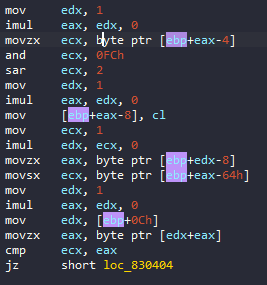

Đoạn này sẽ thực hiện (ecx & 0xFC) >> 2 để duyệt toàn string lưu tại ecx và dịch 2 bit, sau đó so sánh với eax, tức là byte thứ 3 trong chuỗi 4 byte, nếu bằng nhau thì tới bước tiếp theo.

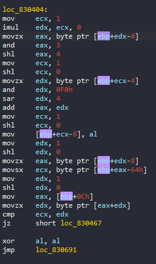

Bước này sẽ thực hiện `(eax & 0x3) << 4 | (edx & 0xF0) >> 4` và so sánh với phần tử thứ 3 trong chuỗi 4 byte, nếu bằng nhau thì tới bước tiếp theo.

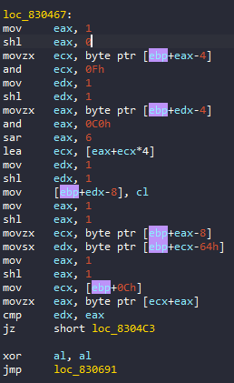

`a = (ecx & 0xF)`
`b = (eax & 0xC0) >> 6`
Kết quả của `b + 4 * a` sẽ là vị trí của char được dùng để so sánh với byte thứ 3 trong chuỗi 4 byte, nếu đúng, tới bước tiếp theo.

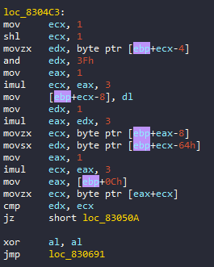

`edx & 0x3F` là vị trí của char được lấy ra để kiểm tra, kiểm tra giống như các bước trên, kiểm tra kết thúc tại đây.

- Case 4: 
Case cuối tương đối ngắn.
XOR từng byte của chuỗi bắt đầu từ vị trí chỉ định với array {0xA8, 0x53, 0xDD, 0x63} rồi so sánh với 4 byte của chương trình, nếu đúng thì return 1.

# Solve
```c
#include <stdio.h>

// len = 1464 
unsigned char raw_data[] = {
	/*	Số thứ tự case	*/  /*	Vị trí so sánh	 */ /*	String so sánh	*/
	0x01, 0x00, 0x00, 0x00, 0x00, 0x00, 0x00, 0x00, 0x74, 0xCC, 0xCC, 0xCC,
	0x01, 0x00, 0x00, 0x00, 0x01, 0x00, 0x00, 0x00, 0x48, 0xCC, 0xCC, 0xCC,
	0x01, 0x00, 0x00, 0x00, 0x02, 0x00, 0x00, 0x00, 0x3B, 0xCC, 0xCC, 0xCC,
	0x02, 0x00, 0x00, 0x00, 0x88, 0x00, 0x00, 0x00, 0x81, 0x24, 0xCC, 0xCC,
	0x03, 0x00, 0x00, 0x00, 0x6F, 0x00, 0x00, 0x00, 0x63, 0x33, 0x59, 0x6F,
	0x02, 0x00, 0x00, 0x00, 0x84, 0x00, 0x00, 0x00, 0x01, 0x01, 0xCC, 0xCC,
	0x02, 0x00, 0x00, 0x00, 0x0A, 0x00, 0x00, 0x00, 0x35, 0xAF, 0xCC, 0xCC,
	0x01, 0x00, 0x00, 0x00, 0xD0, 0x00, 0x00, 0x00, 0x33, 0xCC, 0xCC, 0xCC,
	0x03, 0x00, 0x00, 0x00, 0x0F, 0x00, 0x00, 0x00, 0x64, 0x4D, 0x78, 0x76,
	0x04, 0x00, 0x00, 0x00, 0x12, 0x00, 0x00, 0x00, 0xDD, 0x20, 0xB1, 0x1A,
	0x01, 0x00, 0x00, 0x00, 0x06, 0x01, 0x00, 0x00, 0x0C, 0xCC, 0xCC, 0xCC,
	0x03, 0x00, 0x00, 0x00, 0xE8, 0x00, 0x00, 0x00, 0x6A, 0x44, 0x42, 0x35,
	0x02, 0x00, 0x00, 0x00, 0x1D, 0x00, 0x00, 0x00, 0xA6, 0x21, 0xCC, 0xCC,
	0x02, 0x00, 0x00, 0x00, 0x1F, 0x00, 0x00, 0x00, 0xBE, 0x8A, 0xCC, 0xCC,
	0x01, 0x00, 0x00, 0x00, 0x21, 0x00, 0x00, 0x00, 0x4C, 0xCC, 0xCC, 0xCC,
	0x02, 0x00, 0x00, 0x00, 0x22, 0x00, 0x00, 0x00, 0x26, 0x0E, 0xCC, 0xCC,
	0x01, 0x00, 0x00, 0x00, 0x24, 0x00, 0x00, 0x00, 0x35, 0xCC, 0xCC, 0xCC,
	0x01, 0x00, 0x00, 0x00, 0x5D, 0x00, 0x00, 0x00, 0x3B, 0xCC, 0xCC, 0xCC,
	0x03, 0x00, 0x00, 0x00, 0x2B, 0x00, 0x00, 0x00, 0x6A, 0x45, 0x39, 0x75,
	0x04, 0x00, 0x00, 0x00, 0x16, 0x00, 0x00, 0x00, 0x88, 0x3F, 0xED, 0x0D,
	0x03, 0x00, 0x00, 0x00, 0xEB, 0x00, 0x00, 0x00, 0x6A, 0x33, 0x56, 0x7A,
	0x02, 0x00, 0x00, 0x00, 0x32, 0x00, 0x00, 0x00, 0x35, 0xAF, 0xCC, 0xCC,
	0x02, 0x00, 0x00, 0x00, 0x30, 0x00, 0x00, 0x00, 0xAB, 0x2F, 0xCC, 0xCC,
	0x02, 0x00, 0x00, 0x00, 0x08, 0x00, 0x00, 0x00, 0x81, 0x36, 0xCC, 0xCC,
	0x03, 0x00, 0x00, 0x00, 0x34, 0x00, 0x00, 0x00, 0x6A, 0x6C, 0x63, 0x75,
	0x01, 0x00, 0x00, 0x00, 0x37, 0x00, 0x00, 0x00, 0x00, 0xCC, 0xCC, 0xCC,
	0x02, 0x00, 0x00, 0x00, 0x38, 0x00, 0x00, 0x00, 0x25, 0x3C, 0xCC, 0xCC,
	0x03, 0x00, 0x00, 0x00, 0x53, 0x00, 0x00, 0x00, 0x49, 0x46, 0x52, 0x67,
	0x01, 0x00, 0x00, 0x00, 0x3E, 0x00, 0x00, 0x00, 0x21, 0xCC, 0xCC, 0xCC,
	0x01, 0x00, 0x00, 0x00, 0x3F, 0x00, 0x00, 0x00, 0x54, 0xCC, 0xCC, 0xCC,
	0x01, 0x00, 0x00, 0x00, 0x92, 0x00, 0x00, 0x00, 0x37, 0xCC, 0xCC, 0xCC,
	0x01, 0x00, 0x00, 0x00, 0x86, 0x00, 0x00, 0x00, 0x74, 0xCC, 0xCC, 0xCC,
	0x04, 0x00, 0x00, 0x00, 0x09, 0x01, 0x00, 0x00, 0xC0, 0x36, 0xFD, 0x13,
	0x01, 0x00, 0x00, 0x00, 0x4A, 0x00, 0x00, 0x00, 0x00, 0xCC, 0xCC, 0xCC,
	0x01, 0x00, 0x00, 0x00, 0x0D, 0x01, 0x00, 0x00, 0x52, 0xCC, 0xCC, 0xCC,
	0x04, 0x00, 0x00, 0x00, 0x4D, 0x00, 0x00, 0x00, 0xC1, 0x3D, 0xBA, 0x43,
	0x03, 0x00, 0x00, 0x00, 0x1C, 0x01, 0x00, 0x00, 0x64, 0x32, 0x77, 0x6F,
	0x04, 0x00, 0x00, 0x00, 0x3A, 0x00, 0x00, 0x00, 0xCD, 0x73, 0xB0, 0x0C,
	0x04, 0x00, 0x00, 0x00, 0x56, 0x00, 0x00, 0x00, 0xCD, 0x73, 0xB9, 0x06,
	0x03, 0x00, 0x00, 0x00, 0x5A, 0x00, 0x00, 0x00, 0x51, 0x32, 0x6D, 0x79,
	0x04, 0x00, 0x00, 0x00, 0x0F, 0x01, 0x00, 0x00, 0xCB, 0x36, 0xAE, 0x10,
	0x01, 0x00, 0x00, 0x00, 0x5E, 0x00, 0x00, 0x00, 0x3D, 0xCC, 0xCC, 0xCC,
	0x02, 0x00, 0x00, 0x00, 0x5F, 0x00, 0x00, 0x00, 0x01, 0x21, 0xCC, 0xCC,
	0x04, 0x00, 0x00, 0x00, 0x68, 0x00, 0x00, 0x00, 0x88, 0x27, 0xB5, 0x06,
	0x01, 0x00, 0x00, 0x00, 0xBA, 0x00, 0x00, 0x00, 0x44, 0xCC, 0xCC, 0xCC,
	0x04, 0x00, 0x00, 0x00, 0x9A, 0x00, 0x00, 0x00, 0xDC, 0x3A, 0xBA, 0x06,
	0x03, 0x00, 0x00, 0x00, 0x6C, 0x00, 0x00, 0x00, 0x49, 0x46, 0x4A, 0x6D,
	0x04, 0x00, 0x00, 0x00, 0x04, 0x00, 0x00, 0x00, 0x88, 0x62, 0xAE, 0x43,
	0x04, 0x00, 0x00, 0x00, 0x72, 0x00, 0x00, 0x00, 0xC1, 0x20, 0xFD, 0x0E,
	0x02, 0x00, 0x00, 0x00, 0xC7, 0x00, 0x00, 0x00, 0x3D, 0x86, 0xCC, 0xCC,
	0x01, 0x00, 0x00, 0x00, 0x7A, 0x00, 0x00, 0x00, 0x2B, 0xCC, 0xCC, 0xCC,
	0x04, 0x00, 0x00, 0x00, 0x7B, 0x00, 0x00, 0x00, 0x88, 0x27, 0xB8, 0x0D,
	0x01, 0x00, 0x00, 0x00, 0xC6, 0x00, 0x00, 0x00, 0x0E, 0xCC, 0xCC, 0xCC,
	0x01, 0x00, 0x00, 0x00, 0x83, 0x00, 0x00, 0x00, 0x2B, 0xCC, 0xCC, 0xCC,
	0x01, 0x00, 0x00, 0x00, 0x03, 0x00, 0x00, 0x00, 0x01, 0xCC, 0xCC, 0xCC,
	0x04, 0x00, 0x00, 0x00, 0x93, 0x00, 0x00, 0x00, 0x88, 0x23, 0xBC, 0x13,
	0x04, 0x00, 0x00, 0x00, 0xA9, 0x00, 0x00, 0x00, 0x88, 0x37, 0xB2, 0x43,
	0x03, 0x00, 0x00, 0x00, 0x0C, 0x00, 0x00, 0x00, 0x5A, 0x47, 0x6D, 0x43,
	0x04, 0x00, 0x00, 0x00, 0x8A, 0x00, 0x00, 0x00, 0xCE, 0x36, 0xBC, 0x11,
	0x04, 0x00, 0x00, 0x00, 0x8E, 0x00, 0x00, 0x00, 0xDB, 0x73, 0xBC, 0x11,
	0x04, 0x00, 0x00, 0x00, 0xAF, 0x00, 0x00, 0x00, 0xD1, 0x27, 0xB5, 0x0A,
	0x02, 0x00, 0x00, 0x00, 0x44, 0x00, 0x00, 0x00, 0x25, 0xA5, 0xCC, 0xCC,
	0x01, 0x00, 0x00, 0x00, 0x97, 0x00, 0x00, 0x00, 0x37, 0xCC, 0xCC, 0xCC,
	0x02, 0x00, 0x00, 0x00, 0x98, 0x00, 0x00, 0x00, 0x01, 0x2F, 0xCC, 0xCC,
	0x04, 0x00, 0x00, 0x00, 0x61, 0x00, 0x00, 0x00, 0xDC, 0x3C, 0xFD, 0x02,
	0x01, 0x00, 0x00, 0x00, 0x9E, 0x00, 0x00, 0x00, 0x52, 0xCC, 0xCC, 0xCC,
	0x04, 0x00, 0x00, 0x00, 0x9F, 0x00, 0x00, 0x00, 0xDB, 0x7D, 0xFD, 0x3A,
	0x04, 0x00, 0x00, 0x00, 0x46, 0x00, 0x00, 0x00, 0xCB, 0x26, 0xB1, 0x17,
	0x01, 0x00, 0x00, 0x00, 0xA7, 0x00, 0x00, 0x00, 0x33, 0xCC, 0xCC, 0xCC,
	0x01, 0x00, 0x00, 0x00, 0x2F, 0x00, 0x00, 0x00, 0x00, 0xCC, 0xCC, 0xCC,
	0x01, 0x00, 0x00, 0x00, 0x87, 0x00, 0x00, 0x00, 0x48, 0xCC, 0xCC, 0xCC,
	0x01, 0x00, 0x00, 0x00, 0xAD, 0x00, 0x00, 0x00, 0x33, 0xCC, 0xCC, 0xCC,
	0x01, 0x00, 0x00, 0x00, 0xAE, 0x00, 0x00, 0x00, 0x4E, 0xCC, 0xCC, 0xCC,
	0x04, 0x00, 0x00, 0x00, 0xC9, 0x00, 0x00, 0x00, 0xC7, 0x26, 0xFD, 0x00,
	0x02, 0x00, 0x00, 0x00, 0xB3, 0x00, 0x00, 0x00, 0x22, 0xA1, 0xCC, 0xCC,
	0x01, 0x00, 0x00, 0x00, 0xB5, 0x00, 0x00, 0x00, 0x00, 0xCC, 0xCC, 0xCC,
	0x04, 0x00, 0x00, 0x00, 0xB6, 0x00, 0x00, 0x00, 0xD1, 0x3C, 0xA8, 0x43,
	0x03, 0x00, 0x00, 0x00, 0x65, 0x00, 0x00, 0x00, 0x51, 0x33, 0x59, 0x73,
	0x01, 0x00, 0x00, 0x00, 0xBB, 0x00, 0x00, 0x00, 0x37, 0xCC, 0xCC, 0xCC,
	0x01, 0x00, 0x00, 0x00, 0xBC, 0x00, 0x00, 0x00, 0x31, 0xCC, 0xCC, 0xCC,
	0x04, 0x00, 0x00, 0x00, 0xD2, 0x00, 0x00, 0x00, 0xDC, 0x73, 0xA9, 0x0C,
	0x03, 0x00, 0x00, 0x00, 0xBF, 0x00, 0x00, 0x00, 0x5A, 0x54, 0x42, 0x38,
	0x02, 0x00, 0x00, 0x00, 0xC2, 0x00, 0x00, 0x00, 0x81, 0x21, 0xCC, 0xCC,
	0x01, 0x00, 0x00, 0x00, 0xDA, 0x00, 0x00, 0x00, 0x4E, 0xCC, 0xCC, 0xCC,
	0x04, 0x00, 0x00, 0x00, 0x7F, 0x00, 0x00, 0x00, 0xC9, 0x30, 0xB4, 0x17,
	0x04, 0x00, 0x00, 0x00, 0x76, 0x00, 0x00, 0x00, 0xCD, 0x21, 0xB8, 0x0F,
	0x04, 0x00, 0x00, 0x00, 0xFB, 0x00, 0x00, 0x00, 0xCD, 0x73, 0xAD, 0x11,
	0x02, 0x00, 0x00, 0x00, 0xCD, 0x00, 0x00, 0x00, 0xA6, 0x26, 0xCC, 0xCC,
	0x01, 0x00, 0x00, 0x00, 0xCF, 0x00, 0x00, 0x00, 0x00, 0xCC, 0xCC, 0xCC,
	0x02, 0x00, 0x00, 0x00, 0x4B, 0x00, 0x00, 0x00, 0x25, 0x2C, 0xCC, 0xCC,
	0x01, 0x00, 0x00, 0x00, 0xD1, 0x00, 0x00, 0x00, 0x31, 0xCC, 0xCC, 0xCC,
	0x02, 0x00, 0x00, 0x00, 0xBD, 0x00, 0x00, 0x00, 0xA3, 0x22, 0xCC, 0xCC,
	0x03, 0x00, 0x00, 0x00, 0x13, 0x01, 0x00, 0x00, 0x49, 0x47, 0x6D, 0x79,
	0x02, 0x00, 0x00, 0x00, 0xC4, 0x00, 0x00, 0x00, 0x26, 0xA4, 0xCC, 0xCC,
	0x03, 0x00, 0x00, 0x00, 0xEF, 0x00, 0x00, 0x00, 0x6A, 0x47, 0x6D, 0x6C,
	0x04, 0x00, 0x00, 0x00, 0xDC, 0x00, 0x00, 0x00, 0xCD, 0x73, 0xBC, 0x0D,
	0x01, 0x00, 0x00, 0x00, 0xEE, 0x00, 0x00, 0x00, 0x00, 0xCC, 0xCC, 0xCC,
	0x04, 0x00, 0x00, 0x00, 0xE4, 0x00, 0x00, 0x00, 0xC6, 0x27, 0xAF, 0x0C,
	0x03, 0x00, 0x00, 0x00, 0x1A, 0x00, 0x00, 0x00, 0x5A, 0x31, 0x39, 0x55,
	0x01, 0x00, 0x00, 0x00, 0x2E, 0x00, 0x00, 0x00, 0x35, 0xCC, 0xCC, 0xCC,
	0x04, 0x00, 0x00, 0x00, 0xE0, 0x00, 0x00, 0x00, 0xCC, 0x73, 0xBE, 0x0C,
	0x01, 0x00, 0x00, 0x00, 0xDB, 0x00, 0x00, 0x00, 0x35, 0xCC, 0xCC, 0xCC,
	0x02, 0x00, 0x00, 0x00, 0xF2, 0x00, 0x00, 0x00, 0x8C, 0xA4, 0xCC, 0xCC,
	0x04, 0x00, 0x00, 0x00, 0xF4, 0x00, 0x00, 0x00, 0x88, 0x32, 0xB3, 0x07,
	0x02, 0x00, 0x00, 0x00, 0x25, 0x00, 0x00, 0x00, 0xA7, 0x39, 0xCC, 0xCC,
	0x04, 0x00, 0x00, 0x00, 0x40, 0x00, 0x00, 0x00, 0x88, 0x37, 0xB4, 0x05,
	0x01, 0x00, 0x00, 0x00, 0xFF, 0x00, 0x00, 0x00, 0x3D, 0xCC, 0xCC, 0xCC,
	0x03, 0x00, 0x00, 0x00, 0x00, 0x01, 0x00, 0x00, 0x51, 0x32, 0x56, 0x6B,
	0x03, 0x00, 0x00, 0x00, 0x03, 0x01, 0x00, 0x00, 0x64, 0x58, 0x4A, 0x6D,
	0x04, 0x00, 0x00, 0x00, 0x27, 0x00, 0x00, 0x00, 0xC7, 0x1D, 0xBA, 0x3C,
	0x02, 0x00, 0x00, 0x00, 0x07, 0x01, 0x00, 0x00, 0x2B, 0x06, 0xCC, 0xCC,
	0x04, 0x00, 0x00, 0x00, 0xA3, 0x00, 0x00, 0x00, 0xC7, 0x26, 0xFD, 0x00,
	0x01, 0x00, 0x00, 0x00, 0xA8, 0x00, 0x00, 0x00, 0x4E, 0xCC, 0xCC, 0xCC,
	0x01, 0x00, 0x00, 0x00, 0x0E, 0x01, 0x00, 0x00, 0x3D, 0xCC, 0xCC, 0xCC,
	0x03, 0x00, 0x00, 0x00, 0xF8, 0x00, 0x00, 0x00, 0x49, 0x46, 0x52, 0x67,
	0x04, 0x00, 0x00, 0x00, 0xD6, 0x00, 0x00, 0x00, 0x88, 0x30, 0xB5, 0x02,
	0x02, 0x00, 0x00, 0x00, 0x16, 0x01, 0x00, 0x00, 0x25, 0x86, 0xCC, 0xCC,
	0x04, 0x00, 0x00, 0x00, 0x18, 0x01, 0x00, 0x00, 0xDC, 0x20, 0xFD, 0x0C,
	0x02, 0x00, 0x00, 0x00, 0x51, 0x00, 0x00, 0x00, 0xA8, 0xA2, 0xCC, 0xCC,
	0x03, 0x00, 0x00, 0x00, 0x1F, 0x01, 0x00, 0x00, 0x63, 0x6C, 0x56, 0x33,
	0x03, 0x00, 0x00, 0x00, 0x22, 0x01, 0x00, 0x00, 0x51, 0x58, 0x4A, 0x6B,
	0x01, 0x00, 0x00, 0x00, 0x25, 0x01, 0x00, 0x00, 0x0E, 0xCC, 0xCC, 0xCC};

int TwoCharsToInt(unsigned char char1, unsigned char char2)
{
	int number = (char1 << 8) | char2; // Kết hợp 2 ký tự thành 1 số nguyên
	return number;
}

int FindCharPosition(const char* str, char target)
{
	int position = -1;
	for (int i = 0; str[i] != '\0'; ++i)
	{
		if (str[i] == target)
		{
			position = i;
			break;
		}
	}
	return position;
}

int main()
{
	char flag[301];
	const char* arr1 = "ABDCEHGFIJKLUNOPYRTSMVWXQZajcdefohibkmlngpqrstuv4xzy8123w56709+";

	for (int i = 0; i < 1464; i += 12)
	{
		int j = raw_data[i];
		int position = TwoCharsToInt(raw_data[i + 5], raw_data[i + 4]);
		int encode_byte1, encode_byte2;

		switch (j)
		{
			case 1:
				encode_byte1 = raw_data[i + 8];
				if (encode_byte1 % 2 == 0)
					flag[position] = encode_byte1 ^ 0x20;
				else
					flag[position] = encode_byte1 ^ 0x52;

				break;
			case 2:
				encode_byte2 = TwoCharsToInt(raw_data[i + 9], raw_data[i + 8]);
				int c1;
				char char1, char2;

				for (c1 = 5; c1 > 0; c1--)
				{
					int temp = encode_byte2 ^ 0x1693;
					temp = (temp >> c1) | (temp << (16 - c1));
					temp = temp & 0xFFFF;
					encode_byte2 = temp;
				}

				char1 = (encode_byte2 >> 8) & 0xFF;   // Lấy 8 bit cao nhất
				char2 = encode_byte2 & 0xFF;		      // Lấy 8 bit thấp nhất

				flag[position] = char1;
				flag[position + 1] = char2;

				break;
			case 3:
				char arr2[4];
				int c2, t;
				char d, e;

				for (c2 = 0; c2 < 4; c2++)			
					arr2[c2] = FindCharPosition(arr1, raw_data[i + 8 + c2]);			

				flag[position] = (arr2[0] << 2) | (arr2[1] >> 4);

				for (t = 0; t < 4; t++)
				{
					if ((arr2[2] - t) % 4 == 0)
					{
						d = (arr2[2] - t) / 4;
						e = t;
					}
				}

				flag[position + 1] = (arr2[1] << 4) | d;
				flag[position + 2] = (e << 6) | arr2[3];

				break;
			case 4:
				unsigned char arr3[4] = { 0xA8, 0x53, 0xDD, 0x63 };
				int c3;

				for (c3 = 0; c3 < 4; c3++)			
					flag[position + c3] = raw_data[i + 8 + c3] ^ arr3[c3];

				break;
		}
	}
	flag[300] = '\0';

	printf("\n%s\n", flag);

	return 0;
}
```

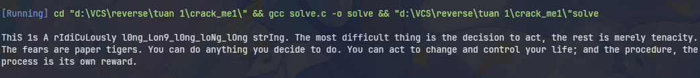

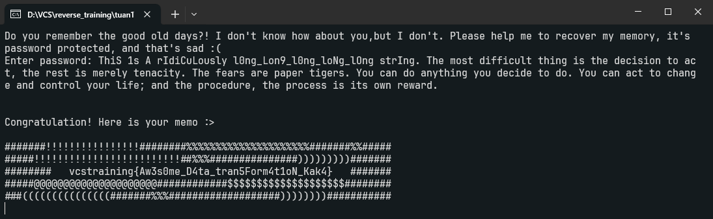

Flag: `vcstraining{Aw3s0me_D4ta_tran5Form4t1oN_Kak4}`
