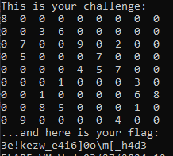
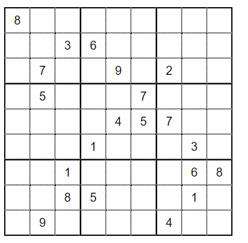
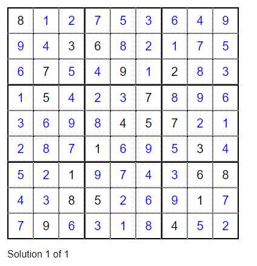
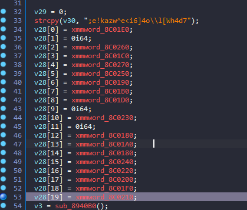
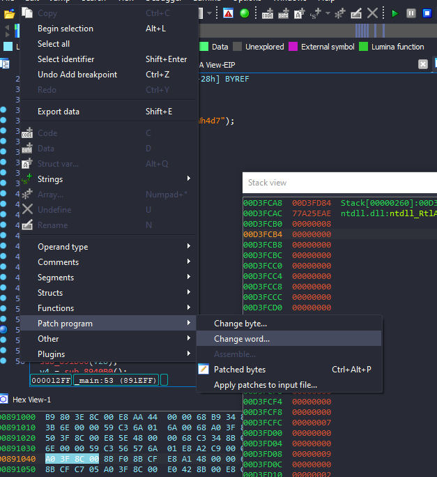
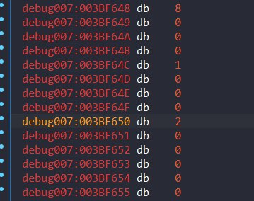
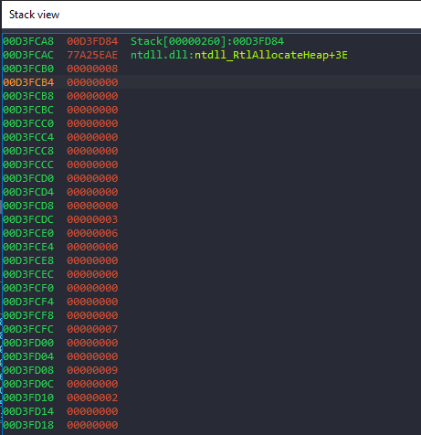

# ezsudoku

Chạy thử chương trình, ta có output như sau:  

 
Một chương trình sudoku, theo suy đoán của em thì có lẽ chúng ta cần điền vào các chỗ `0` các số theo đúng luật sudoku thì sẽ nhận được flag.
 

Ta dùng [solver](https://sudokuspoiler.com) tự động để giải.  

 

 

 
 
Phân tích source code, ta thấy `v28` có khả năng là mảng chứa các phần tử của bảng sudoku.
Đặt breakpoint vào cuối mảng `v28` và `return 0`, bắt đầu debug.
 

 

 
Ta sẽ patch từng giá trị `0` với các giá trị đúng sau khi solve bảng sudoku. Vì 1 lý do nào đó mà các phần tử cách nhau 3 hàng, patch cho tới hết mảng sudoku.
 

 
Flag: `3a$iest_g4m3_0f_mY_l1f3`