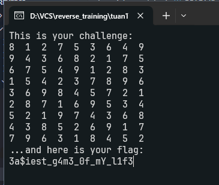

# ezsudoku

Chạy thử chương trình, ta có output như sau:

Một chương trình sudoku, theo suy đoán của em thì có lẽ chúng ta cần điền vào các chỗ `0` các số theo đúng luật sudoku thì sẽ nhận được flag.
 

Ta dùng [solver](https://sudokuspoiler.com) tự động để giải.

 

 

Phân tích source code, ta thấy `v28` có khả năng là mảng chứa các phần tử của bảng sudoku.
Đặt breakpoint vào cuối mảng `v28` và `return 0`, bắt đầu debug.

Quan sát stack view, địa chỉ mảng `v28` bắt đầu từ địa chỉ `00D3FCB0`.

Ta sẽ patch từng giá trị `0` với các giá trị đúng sau khi solve bảng sudoku.
 

