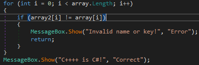

# Basic DotNet


Dùng DIE kiểm tra, ta thấy binary này được viết bằng C#, sử dụng library .NET.
<br>

Nhưng trước đó, ta chạy thử chương trình trước, giao diện như hình:

<br>
Chương trình nhận vào 2 tham số là `Name` và `Key`, và check bằng một phương pháp gì đó, nếu check fail thì sẽ báo lỗi.

<br>

 Thả vào DNSpy để reverse nào. Trước tiên t xem hàm `button1_Click`, chính là button `Check`.

<br>

Đoạn code chính biến đổi đầu vào.

Ta cần hiểu các input được biến đổi như thế nào. Trước tiên, text từ input box 1 (Name) được convert thành byte array, rồi được đưa vào hàm `Encode(byte[] data, byte[] key)`, với `key` là byte array tạo từ string `"c-sharp"`, kết quả return là 1 byte array.

Hàm này thực ra chỉ là RC4 được tự implement.


Text từ input box 2 (Key) được xử lí qua hàm `FromHex(string hex)`, convert input từ hex sang sang byte array.

Sau cùng thì sẽ qua 1 đoạn if statement, kiểm tra 2 string có giống nhau không, nếu không thì popup MessageBox với message `Invalid name or key!`

Mục đích của chúng ta ở đây là pass đoạn if check và trigger MessageBox `C++++ is C#!`.

Chương trình còn có 1 button `Hint` hiện format key cần nhập.


Code giải mã key như sau:
```python
def encode(data, key):
    array = [i for i in range(256)]
    array2 = [0] * 256

    if len(key) == 256:
        array2 = key[:]
    else:
        for j in range(256):
            array2[j] = key[j % len(key)]

    num = 0
    k = 0
    for k in range(256):
        num = (num + array[k] + array2[k]) % 256
        array[k], array[num] = array[num], array[k]

    num = k = 0
    array3 = [0] *len(data)
    for l in range(len(data)):
        k = (k + 1) % 256
        num = (num + array[k]) % 256
        array[k], array[num] = array[num], array[k]
        num4 = array[(array[k] + array[num]) % 256]
        array3[l] = bytes([data[l] ^ num4]).hex()

    return array3

def fromhex(A_0):
    A_0 = A_0.replace("-", "")
    array = [0] * (len(A_0)//2)
    for i in range(len(array)):
        array[i] = bytes([int(A_0[i * 2:i * 2 + 2], 16)]).hex()
    return array

key = fromhex("a0-d3-57-17-e2-17-98-82-ae-42-0b-df-2a-80-ec-d0-1b-f2-2e-62-67-96-f3-ba")
b = b''

for i in key:
    b += bytes.fromhex(i)

print("".join([chr(int(i, 16)) for i in encode(b, "c-sharp".encode())]))
```
Flag:


