# Imposter DotNet

Chương trình viết bằng C#, với library .NET
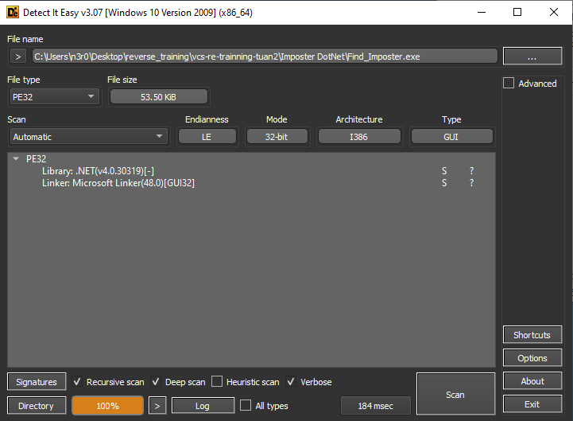
<br>

Trước khi reverse, ta cùng chạy thử.
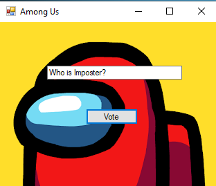
Chương trình có input box duy nhất và 1 button `Vote`, nhập bất kì để xem hành vi của chương trình.
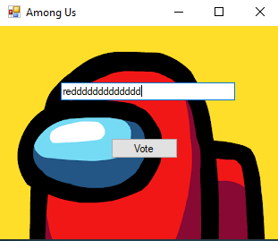
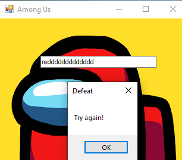
Input vừa nhập vào là invalidated, nhận được `MessageBox` với thông báo `Defeat`.

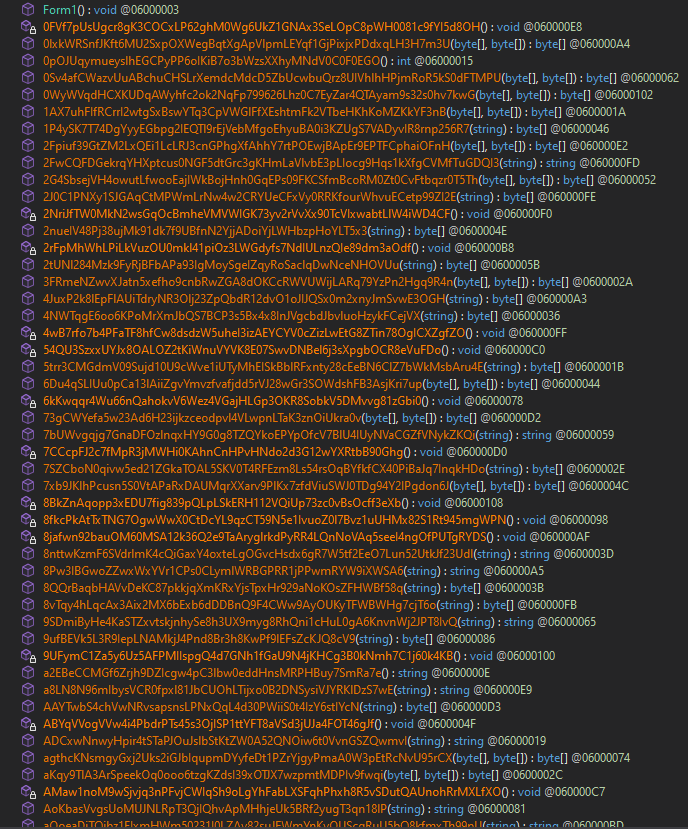
Bên trong có rất nhiều hàm, với tên đều bị obfuscate.

Ta bắt đầu từ hàm `button1_Click`.
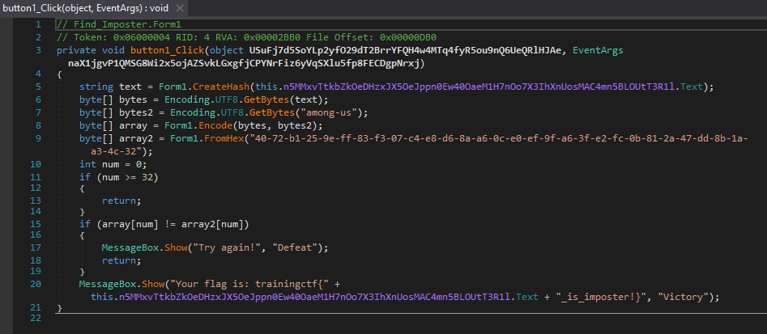
Chương trình bắt đầu thực hiện các thao tác biến đổi input:
- `array` sẽ lưu kết quả dưới dạng bytes sau khi cipher RC4 của input với key là dạng bytes của string "among-us"
- `array2` là dạng bytes của chuỗi hex `40-72-b1-25-9e-ff-83-f3-07-c4-e8-d6-8a-a6-0c-e0-ef-9f-a6-3f-e2-fc-0b-81-2a-47-dd-8b-1a-a3-4c-32`

Chương trình khá bruh khi gán `num = 0` và chỉ so sánh byte đầu tiên của 2 array.
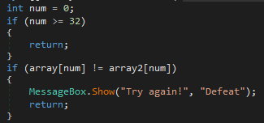

Ta có thể brute force input như sau:
```python
import string
import itertools
import hashlib

def gen_hash(A_0):
    md5 = hashlib.md5()
    md5.update(A_0.encode('ascii'))
    result = md5.hexdigest()
    return result

def encode(data, key):
    array = [i for i in range(256)]
    array2 = [0] * 256

    if len(key) == 256:
        array2 = key[:]
    else:
        for j in range(256):
            array2[j] = key[j % len(key)]

    num = 0
    k = 0
    for k in range(256):
        num = (num + array[k] + array2[k]) % 256
        array[k], array[num] = array[num], array[k]

    num = k = 0
    array3 = [0] * len(data)
    for l in range(len(data)):
        k = (k + 1) % 256
        num = (num + array[k]) % 256
        array[k], array[num] = array[num], array[k]
        num4 = array[(array[k] + array[num]) % 256]
        array3[l] = bytes([data[l] ^ num4]).hex()

    return array3

def fromhex(A_0):
    A_0 = A_0.replace("-", "")
    array = [0] * (len(A_0)//2)
    for i in range(len(array)):
        array[i] = bytes([int(A_0[i * 2:i * 2 + 2], 16)]).hex()
    return array

possible_char = string.ascii_letters + string.digits 
password_length = 2
all = []    # Array of results

# Brute force lmao :P
for combination in itertools.product(possible_char, repeat=password_length):
    attempt = ''.join(combination)
    a = gen_hash(attempt)
    b = a.encode('utf-8')
    c = "among-us".encode('utf-8')
    check = "".join(encode(b, c))[:2]
    # Check if first byte is 40, cuz hex string's first byte is 40
    if check == "40":
        # all.append(attempt)
        print(attempt)
        break        

# print(all)
```
Có thể chỉnh độ dài input với `password_length`.

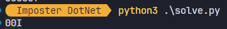

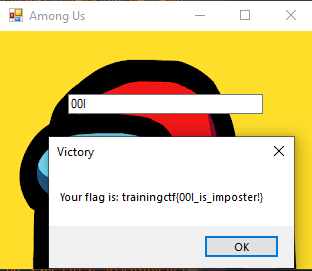

Có thể sửa code một chút để lấy danh sách các payload thoả điều kiện.
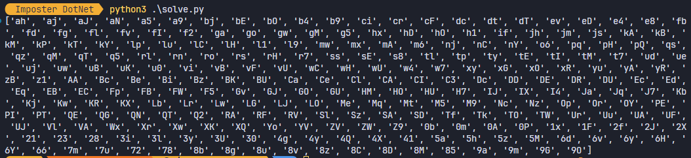

Một cách khác, em tìm được 1 string khá sú trong stack khi debug.
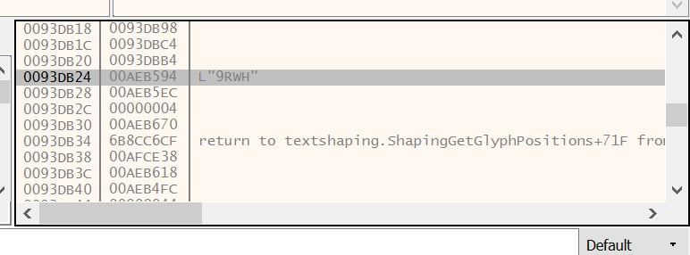

Test thử với chương trình thì đúng.
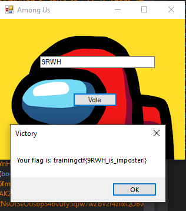

**P/s:** Em cũng không chắc lắm là mình đang làm theo đúng ý người ra đề, nhưng mà cách này nó works :D