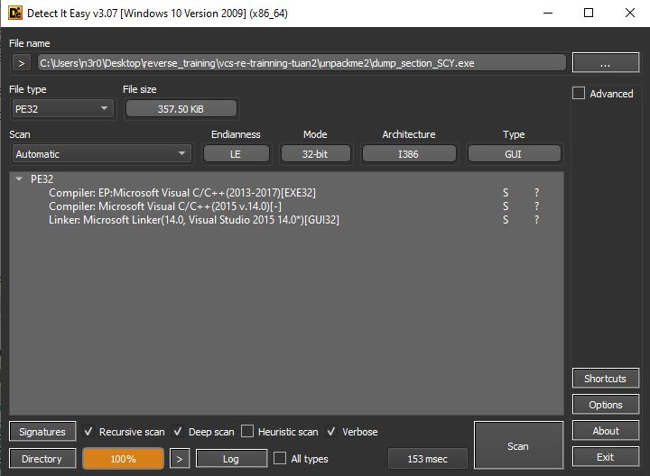

# unpackme2

Chương trình được pack bằng Petite v2.X

Thả chương trình vào x32dbg

Bấm vào nút mũi tên hướng về bên phải để chạy chương trình, chương trình sẽ tự động nhảy về entry point.

F7 cho tới khi chạy qua `pushad`.

Ta nhìn qua phần register, click vào address thanh ghi ESP, chọn `Follow in dump`.

Đỉnh stack sẽ luôn bắt đầu với `9F 91`.

Chọn 4 byte đầu, chuột phải chọn `Breakpoint` -> `Hardware, Access` -> `Dword`.

Run chương trình 1 lần nữa, ta sẽ nhảy qua `popad` tại lệnh `lea`.

F8 liên tục cho tới khi dừng tại đây.

Run thêm 1 lần nữa.

Và F7 liên tục cho tới khi được như hình dưới đây là đã gặp được entry point của chương trình(**CHÚ Ý**: nên spam F7 từ tốn, nếu chạy lố sẽ không quay lại được và phải quay lại từ đầu :">).

Giờ cần sửa IAT, `Ctrl + I` để mở Scylla.

Chọn `IAT Autosearch` -> `Get Imports`.

Chuột trái chọn các thunk có dấu X và delete.

Sau đó vào `File` -> `Dump Section`.

Chọn `Dump`. Sau khi lưu section ra file khác, ta chọn `Fix Dump` để sửa lại.

Tuy nhiên file vẫn chưa chạy được ngay, giờ cần sửa quyển cho section `petite` để có thể thực thi.
Load file dump vào `CFF Explorer`, sửa `Characteristics` thành `E0000060` và save lại.

Chương trình đã có thể chạy được.

Unpack thành công.