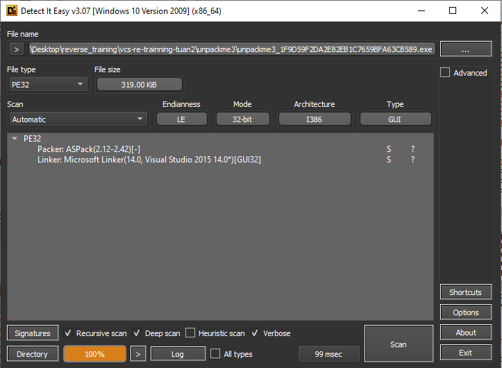
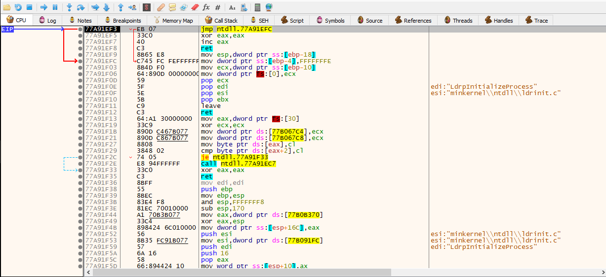

# unpackme3

Chương trình được pack bởi ASPack.

Load chương trình vào x32dbg, chạy chương trình để vào entry point(click vào `Run` hoặc gõ `g` tại `Command`).

F7 1 lần, ta thấy thay đổi trên ESP, sử dụng phương pháp giống như unpack petite, chuột phải vào địa chỉ ESP chọn `Follow in dump`, select 4 byte đầu của dump và đặt breakpoint.

Chạy chương trình 1 lần, và F8 cho đến khi được kết quả như hình.

Đã tìm được đúng OEP của chương trình.

Dùng Scylla dump và fix dump.

Xoá thunk bị sai và dump.

Fix dump và hoàn thành.
