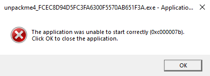

# unpackme4

Chương trình được pack bằng FSG.


Windows 10 không chạy được, cần sử dụng windows 7 để debug.


Sau khi load chương trình vào x32dbg, F9 để jump tới entry point.


Bắt đầu quá trình unpack là các instruction như dưới đây.

```
00400154 | 8725 10AA4A00      | xchg dword ptr ds:[4AAA10],esp
0040015A | 61                 | popad                         
0040015B | 94                 | xchg esp,eax                   
0040015C | 55                 | push ebp                                                  
```

Phía dưới liên tục là các jump instruction (jmp, jne...). Ta đặt breakpoint vào jump instruction sau cùng, tại address `4001D1`.


Sau khi F9 thì chương trình sẽ dừng tại breakpoint, tiếp tục F7 để step into.


Đã tìm được OEP.


`Ctrl + I` mở Scylla -> `IAT Autosearch` -> `Get Imports` và delete thunk không hợp lệ.


Click `Dump` -> `Fix Dump`, chọn file dump vừa rồi để fix.


Unpack và chạy thành công.


