# unpackme6

Chương trình được pack bởi VMProtect.
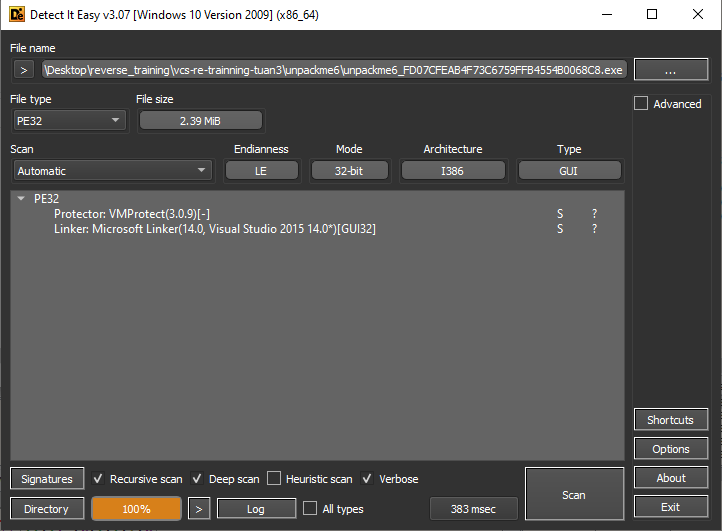

Ý tưởng là sẽ đặt breakpoint tại VirtualProtect.
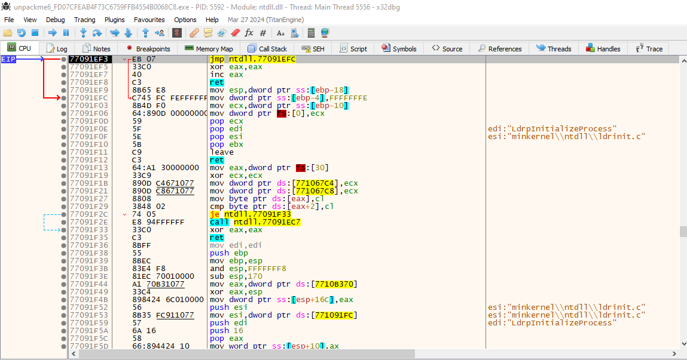

F9 để nhảy tới entry point.
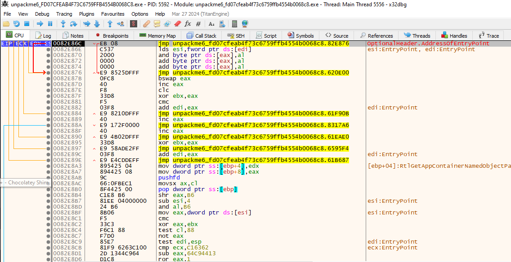

Tại đây, đặt breakpoint tại VirtualProtect bằng command `bp VirtualProtect`.

Vào tab `Memory Map`, chuột phải vào `.text` chọn `Follow in Dump`.
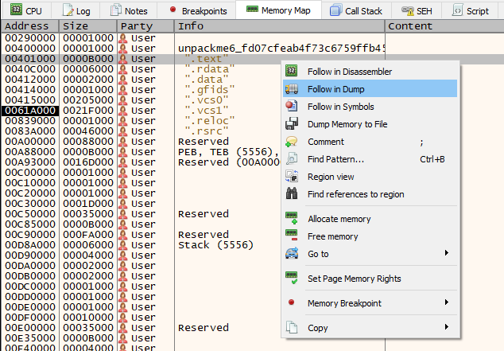

Hiện tại dump chưa có data gì, F9 cho tới khi dump có data.
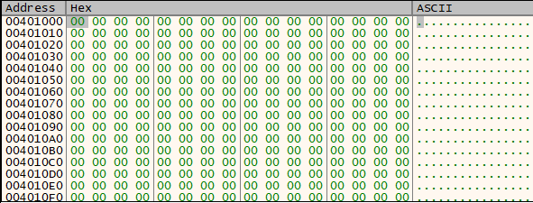

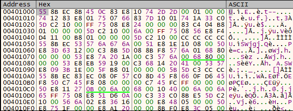

Quay lại tab `Memory Map`, đặt `Memory Breakpoint` -> `Access` -> `Restore`. Section `.text` hiện đang có quyền Write, ta F9 cho tới khi mất quyền Write. Trước đó xoá breakpoint cũ tại `VirtualProtect`.

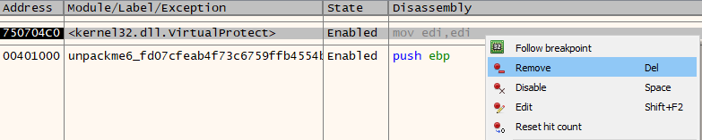

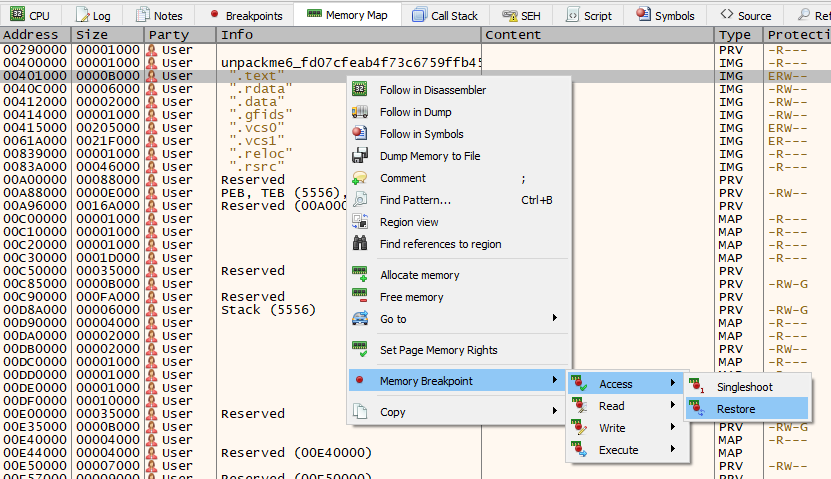

Tiếp tục run cho tới khi gặp OEP tại `AC13088`.
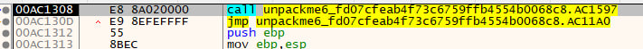

Tương tự các câu trước, dùng scylla search IAT, xoá các thunk không hợp lệ, dump và fix dump.

Load file dump vừa fix vào CFF Explorer, vào tab `Section Headers`, xoá section `.vcs0` và `.vcs1`.

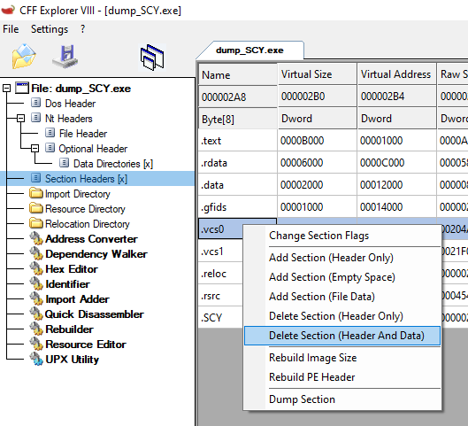

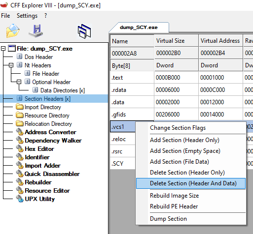

Vào tab `Rebuilder`, chọn `Rebuild`.
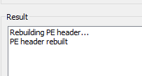

Chọn `File -> Save As`.
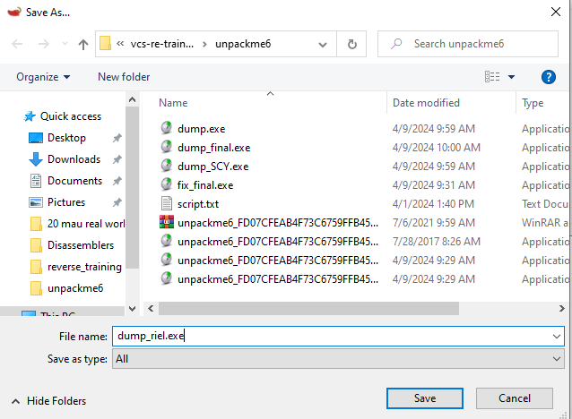

Hoàn thành unpack.
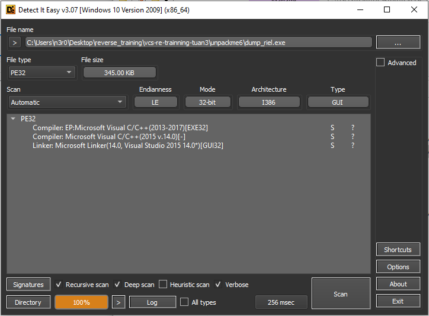

**P/s**: Nhưng vì một vài lí do gì đó mà file unpack không chạy được, dù theo lý thuyết đã dump đúng tại OEP của chương trình :">