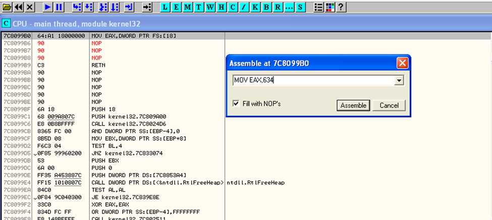

# unpackme7

Chương trình chạy trên Windows XP, pack bằng Yoda's Protector. Sau một hồi tìm hiểu thì biết được loại packer này còn bao gồm anti-debug.

Tại setting, chọn `Break on new module`, sau đó F9.

F9 2 lần cho tới khi xuất hiện `User32.dll` như hình.

Chuột phải vào `User32.dll`, chọn `View code`, ta được như trên.

`Ctrl + G` tìm `BlockInput`.

Chuột phải vào đoạn asm của `BlockInput`, chuột phải chọn `Binary` -> `Fill with NOPs`.

Tương tự trên, tìm `IsDebuggerPresent`.

Fill NOP.

Ghi 0 vào `eax` để disable debugger detection.

Cuối cùng là tìm `GetCurrentProcessId`.

Fill NOP.

Tiếp theo tìm PID của OllyDbg, ta sẽ cần PID để set cho `eax`.

Click nút `M` trên menu bar để vào memory map, set breakpoint tại phần `Code`, sau đó F9.

Đã tới được OEP.

Dùng plugin để dump.

Sau đó scylla fix dump là hoàn thành.

Delete các thunk không hợp lệ.

