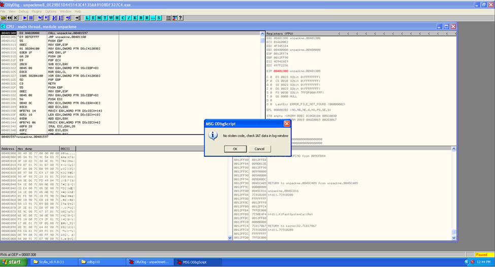
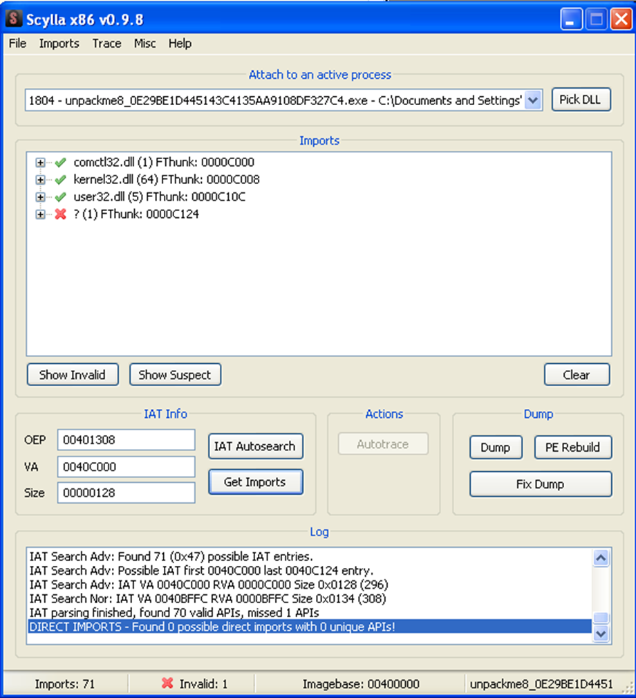
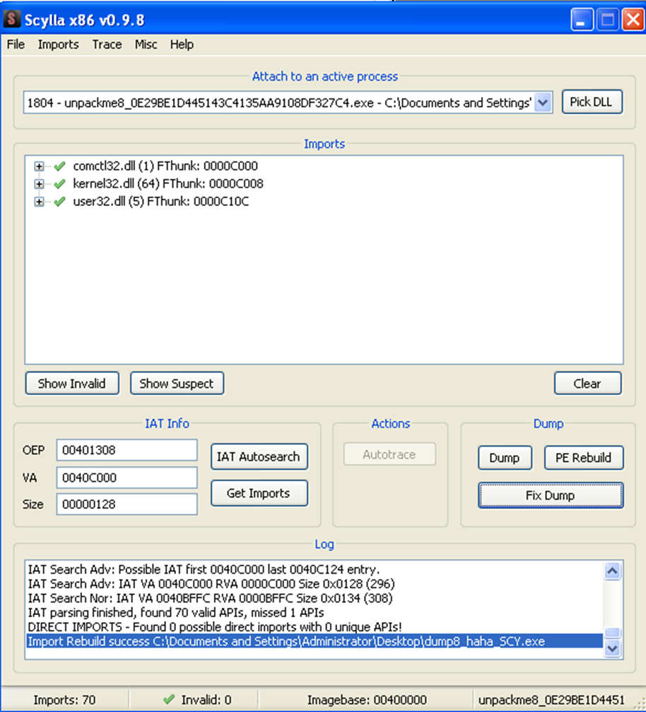
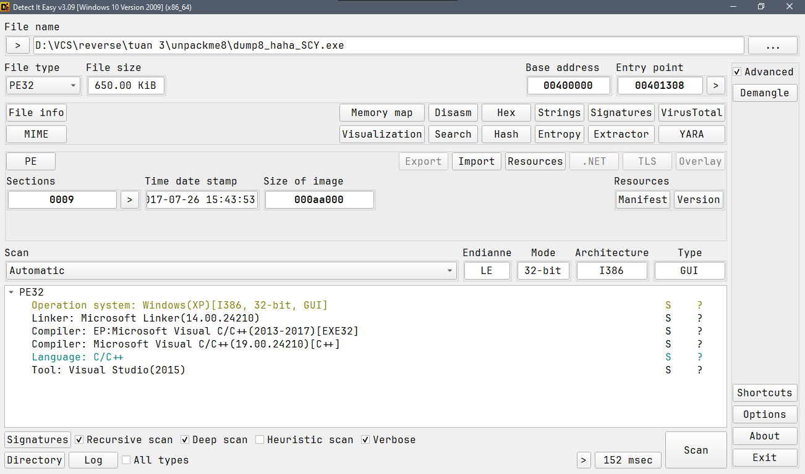

# unpackme8

Chương trình được pack bởi ASProtect.

Vì câu này unpack tương đối phức tạp, sử dụng [script này](https://github.com/dubuqingfeng/ollydbg-script/blob/master/ASProtect/ASProtect%201.3x%20-%202.xx%20Unpacker%20v1.12SC.txt) để unpack.

Dump file ra và dùng Scylla để fix dump.

Delete các thunk không hợp lệ.

