# vm_crackme

Một chương trình nhập key.

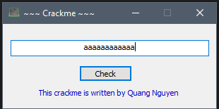

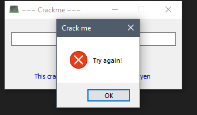

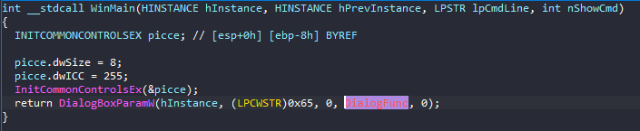

Quan sát tại `WinMain` có sử dụng `DialogBoxParamW` với `DialogFunc`,tương tự như các challenge trước, ta inspect `DialogFunc`.

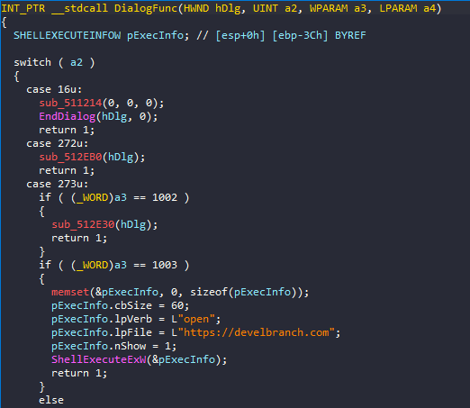

Inspect tiếp các function được dùng, ta chú ý vào `sub_512E30`.

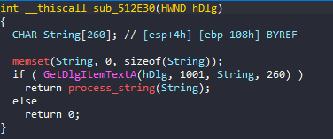

Vào sâu hơn, có thể thấy chương trình tự tạo 2 pipe đề giao tiếp với nhau.

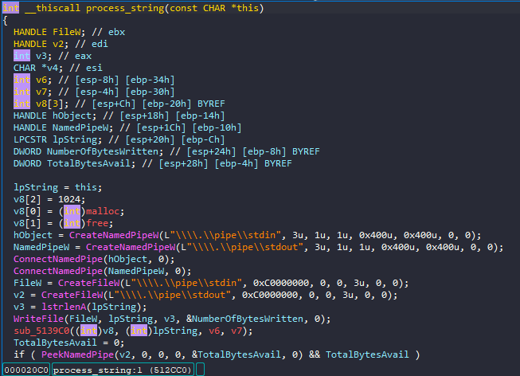

Inspect vào `sub_5139C0` là flow xử lí chính của chương trình như sau:

```c
int __userpurge sub_5139C0@<eax>(int a1@<ecx>, int a2@<esi>, int a3, int a4)
{
  unsigned int v5; // eax
  int v6; // esi
  int v7; // eax
  int v8; // eax
  int v9; // ecx
  int v11; // edx
  int v12; // eax
  int v13; // eax
  char *v14; // ebx
  char v15; // al

  v5 = *(_DWORD *)(a1 + 8);
  if ( v5 < 0xF0 || (v5 & 3) != 0 )
    return -1;
  v6 = (*(int (__stdcall **)(int))a1)(160);
  if ( !v6 )
    return -1;
  v7 = 160;
  *(_BYTE *)v6 = 0;
  do
    *(_BYTE *)(--v7 + v6) = 0;
  while ( v7 );
  v8 = *(_DWORD *)(a1 + 16);
  *(_OWORD *)(v6 + 140) = *(_OWORD *)a1;
  *(_DWORD *)(v6 + 156) = v8;
  v9 = (*(int (__stdcall **)(_DWORD, int))a1)(*(_DWORD *)(v6 + 148), a2);
  *(_DWORD *)(v6 + 136) = v9;
  if ( !v9 )
  {
    (*(void (**)(void))(a1 + 4))();
    return -1;
  }
  v11 = 240;
  v12 = *(_DWORD *)(v6 + 148) - 4;
  *(_DWORD *)(v6 + 28) = fn_1;
  *(_DWORD *)(v6 + 20) = v12;
  *(_DWORD *)(v6 + 152) = *(_DWORD *)(a1 + 12);
  v13 = *(_DWORD *)(a1 + 16);
  v14 = (char *)&unk_524780 - v9;
  *(_DWORD *)(v6 + 32) = fn_2;
  *(_DWORD *)(v6 + 36) = fn_3;
  *(_DWORD *)(v6 + 40) = fn_4;
  *(_DWORD *)(v6 + 44) = fn_5;
  *(_DWORD *)(v6 + 48) = fn_6;
  *(_DWORD *)(v6 + 52) = fn_7;
  *(_DWORD *)(v6 + 56) = fn_8;
  *(_DWORD *)(v6 + 60) = fn_9;
  *(_DWORD *)(v6 + 64) = fn_10;
  *(_DWORD *)(v6 + 68) = fn_11;
  *(_DWORD *)(v6 + 72) = fn_12;
  *(_DWORD *)(v6 + 76) = fn_13;
  *(_DWORD *)(v6 + 80) = fn_14;
  *(_DWORD *)(v6 + 96) = fn_15;
  *(_DWORD *)(v6 + 100) = fn_16;
  *(_DWORD *)(v6 + 104) = fn_17;
  *(_DWORD *)(v6 + 108) = fn_18;
  *(_DWORD *)(v6 + 112) = fn_19;
  *(_DWORD *)(v6 + 116) = fn_20;
  *(_DWORD *)(v6 + 124) = fn_21;
  *(_DWORD *)(v6 + 84) = fn_22;
  *(_DWORD *)(v6 + 88) = fn_23;
  *(_DWORD *)(v6 + 92) = fn_24;
  *(_DWORD *)(v6 + 120) = fn_25;
  *(_DWORD *)(v6 + 128) = fn_26;
  *(_DWORD *)(v6 + 132) = fn_27;
  *(_DWORD *)(v6 + 24) = 0;
  *(_DWORD *)(v6 + 156) = v13;
  do
  {
    v15 = v14[v9++];
    *(_BYTE *)(v9 - 1) = v15;
    --v11;
  }
  while ( v11 );
  if ( *(_DWORD *)(v6 + 24) < *(_DWORD *)(v6 + 148) )
  {
    do
      *(_DWORD *)(v6 + 24) += (*(int (__cdecl **)(int))(v6
                                                      + 4
                                                      * *(unsigned __int8 *)(*(_DWORD *)(v6 + 136) + *(_DWORD *)(v6 + 24))
                                                      + 28))(v6);
    while ( (*(_BYTE *)(v6 + 16) & 1) == 0 && *(_DWORD *)(v6 + 24) < *(_DWORD *)(v6 + 148) );
  }
  (*(void (__cdecl **)(_DWORD))(a1 + 4))(*(_DWORD *)(v6 + 136));
  (*(void (__stdcall **)(int))(a1 + 4))(v6);
  return 0;
}
```

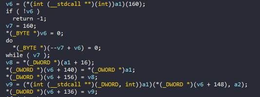

Đoạn này cấp phát vùng nhớ 160 cho biến `v6`.

Đoạn code dưới load vào memory 27 function, đã đổi tên thành `fn_1` đến `fn_27` như trên. Sau khi debug, ta rút ra kết luận về chức năng như sau:

```c
  v11 = 240;
  v12 = *(_DWORD *)(v6 + 148) - 4;
  *(_DWORD *)(v6 + 28) = fn_1;
  *(_DWORD *)(v6 + 20) = v12;
  *(_DWORD *)(v6 + 152) = *(_DWORD *)(a1 + 12);
  v13 = *(_DWORD *)(a1 + 16);
  v14 = (char *)&unk_524780 - v9;
  *(_DWORD *)(v6 + 32) = fn_2;
  *(_DWORD *)(v6 + 36) = fn_3;
  *(_DWORD *)(v6 + 40) = fn_4;
  *(_DWORD *)(v6 + 44) = fn_5;
  *(_DWORD *)(v6 + 48) = fn_6;
  *(_DWORD *)(v6 + 52) = fn_7;
  *(_DWORD *)(v6 + 56) = fn_8;
  *(_DWORD *)(v6 + 60) = fn_9;
  *(_DWORD *)(v6 + 64) = fn_10;
  *(_DWORD *)(v6 + 68) = fn_11;
  *(_DWORD *)(v6 + 72) = fn_12;
  *(_DWORD *)(v6 + 76) = fn_13;
  *(_DWORD *)(v6 + 80) = fn_14;
  *(_DWORD *)(v6 + 96) = fn_15;
  *(_DWORD *)(v6 + 100) = fn_16;
  *(_DWORD *)(v6 + 104) = fn_17;
  *(_DWORD *)(v6 + 108) = fn_18;
  *(_DWORD *)(v6 + 112) = fn_19;
  *(_DWORD *)(v6 + 116) = fn_20;
  *(_DWORD *)(v6 + 124) = fn_21;
  *(_DWORD *)(v6 + 84) = fn_22;
  *(_DWORD *)(v6 + 88) = fn_23;
  *(_DWORD *)(v6 + 92) = fn_24;
  *(_DWORD *)(v6 + 120) = fn_25;
  *(_DWORD *)(v6 + 128) = fn_26;
  *(_DWORD *)(v6 + 132) = fn_27;
  *(_DWORD *)(v6 + 24) = 0;
  *(_DWORD *)(v6 + 156) = v13;
```

Nạp 27 function vào memory, khai báo `v11 = 240`, `v14 = (char *)&unk_524780 - v9` là string dùng cho quá trình tính toán ra key.

```c
do
  {
    v15 = v14[v9++];
    *(_BYTE *)(v9 - 1) = v15;
    --v11;
  }
  while ( v11 );
```

Nạp tiếp string dài 240 char vào `v9` để tính toán ra key, tuy trong pseudo code không gọi tới `v9`, nhưng quan sát trong lúc debug, chuỗi `unk_524780` được gán vào `v9` được nạp hẳn vào memory.


```c
if ( *(_DWORD *)(v6 + 24) < *(_DWORD *)(v6 + 148) )
  {
    do
      *(_DWORD *)(v6 + 24) += (*(int (__cdecl **)(int))(v6
                                                      + 4
                                                      * *(unsigned __int8 *)(*(_DWORD *)(v6 + 136) + *(_DWORD *)(v6 + 24))
                                                      + 28))(v6);
    while ( (*(_BYTE *)(v6 + 16) & 1) == 0 && *(_DWORD *)(v6 + 24) < *(_DWORD *)(v6 + 148) );
  }
```

Đoạn này gọi các function đã được nạp vào memory tại biến `v6`, sau khi debug thì quan sát được rằng 1 số function được gọi đi gọi lại nhiều lần theo thứ tự ngẫu nhiên, có 1 số khác không được gọi, tổng cộng số lần gọi các function là 81 lần.

```c
  (*(void (__cdecl **)(_DWORD))(a1 + 4))(*(_DWORD *)(v6 + 136));
  (*(void (__stdcall **)(int))(a1 + 4))(v6);
```

Trace ngược lại xem xref thì đoạn này là giải phóng tài nguyên.

Vì key được process trong quá trình chạy, nên phải debug để theo dõi quá trình tính toán key.

Một số function đáng chú ý như sau:

`fn_8`:

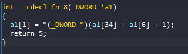

Function này lấy data từ `v9` và ghi vào memory của `v6`.

`fn_9`:

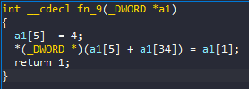

Function này lấy kết quả từ `fn_8` xử lí và lưu tại memory của `v9`, sau này sẽ được dùng bởi các function sau.

2 function này được gọi rất thường xuyên([note về chức năng từng function tại đây](fn.md)). 

Trong quá trình phân tích các hàm được gọi thì có `fn_26`, hàm này sẽ lấy chuỗi kí tự mà chúng ta nhập vào đang nằm ở `eax + 8`, cụ thể là lấy 4 char. Với kí tự thứ nhất sẽ cộng với `0x12`, kí tự thứ hai sẽ trừ `0x78`, kí tự thứ ba sẽ thực hiện lệnh `rol`(rotate left) 2 bit, kí tự thứ tư sẽ thực hiệ `ror`(rote right) 4 bit. `fn_26` được gọi 3 lần tương ứng với 3 lần xử lí 4 phần đầu, giữa, cuối. Kết luận được string input có 12 kí tự.

## Xử lí phần đầu

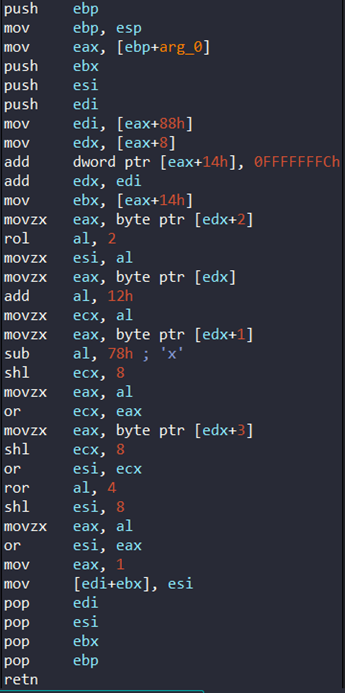

Sau khi gọi `fn_26` tại lần 18, tiếp tục gọi `fn_8` và `fn_9` lưu giá trị `0xBABECAFE` vào memory, sau đó gọi `fn_1` cộng giá trị vừa lưu với 4 char đầu của input(lần gọi thứ [21](fn.md)).

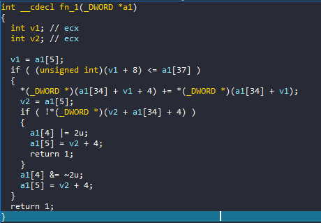

Sau đó là lần gọi 22, `fn_7` thực hiện rotate left 6 bit.

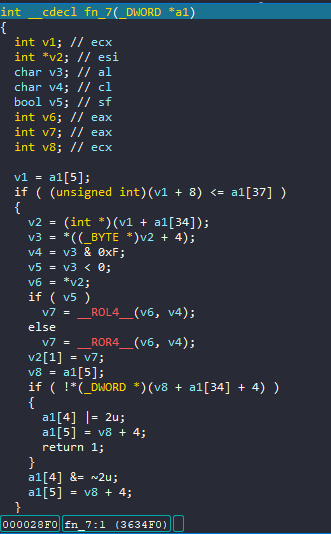

Lần gọi thứ 23 và 24 là `fn_8` và `fn_9` lưu giá trị `0x13371337`, lần 25 là `fn_2` lấy giá trị vừa rồi trừ cho 4 kí tự đầu.

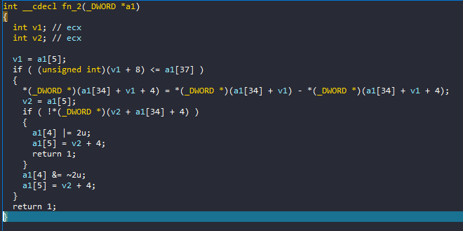

Lần 26 và 27 gọi tiếp `fn_8` và `fn_9` lưu giá trị `0x13371337`, lần 28 gọi `fn_3` xor giá trị vừa rồi với 4 í tự đầu.

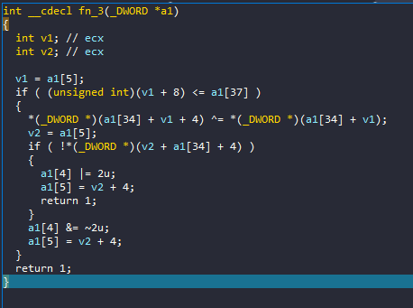

Giai đoạn cuối của bước xử lí phần đầu input, lần 29 và 30 gọi `fn_8` và `fn_9` lưu string `0x2648ED87` vào memory, lần 31 gọi `fn_15` sau đó so sánh với 4 kí tự đầu của input.

Để tìm ra phần đầu của input, ta chỉ cần đảo ngược quá trình biến đổi là được.

```rust
fn main() {
    let p1: i32 = 0x13371337 - (0x2648ED87 ^ 0x13371337);
    let p1 = p1.rotate_right(6);

    println!("{:X}", p1);
}
```

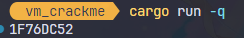

Sau khi đảo ngược `fn_26` ta được `0x52304445`.

Part 1: `R0DE`

## Xử lí phần giữa

Ta đã biết được `fn_26` sẽ xử lí nhận từng phần string, tiếp tục debug tới khi gặp `fn_26`, là vào lần gọi 41.

Sau đó lần 42 và 43 gọi tới `fn_8` và `fn_9`, lưu lại `0xDEADBEEF`, lần 44 gọi `fn_2` lấy string vừa rồi trừ đi 4 kí tự giữa của input.

Lần 45 và 46 gọi tiếp `fn_8` và `fn_9`, lưu lại `0x94C3E659` và gọi `fn_15` để so sánh.

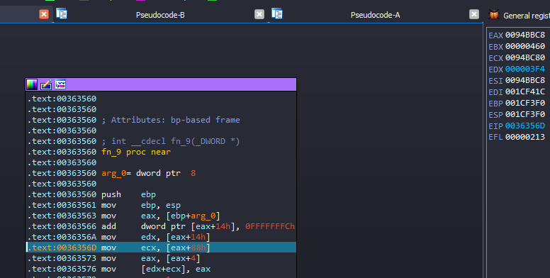


```rust
fn main() {
    let p2: i64 = 0xDEADBEEF - 0x94C3E659;
    println!("{:X}", p2);
}
```

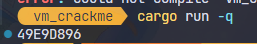

Đảo ngược `fn_26` ta được `0x37613669`.

Part 2: `7a6i`

## Xử lí phần cuối

Debug tiếp cho tới `fn_26`, ta dừng lại tại lần gọi 59. Lần 60 gặp `fn_7`, rotate left 4 bit.

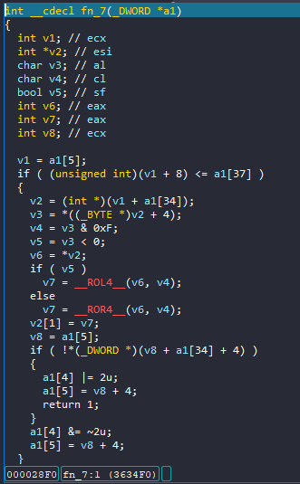

Lần 61 gặp `fn_6`, thực hiện phép not.

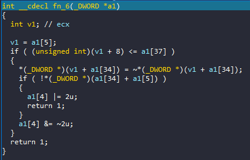

Lần 62 và 63 gọi `fn_8` và `fn_9`, lưu lại `0xABBAABBA` tại eax, sau đó lân 64 gọi `fn_3` xor với string vừa rồi.

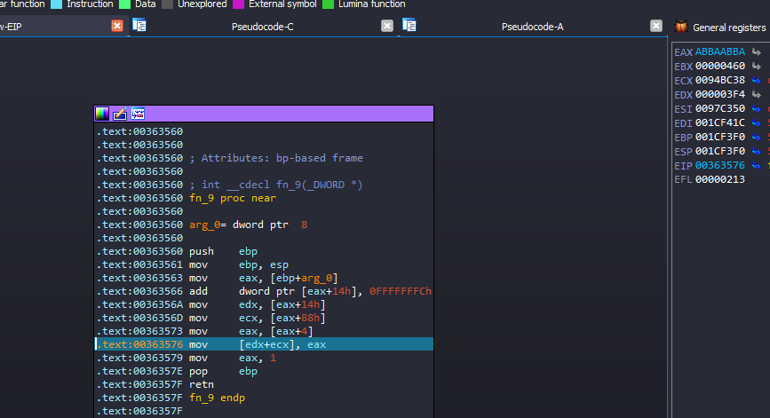

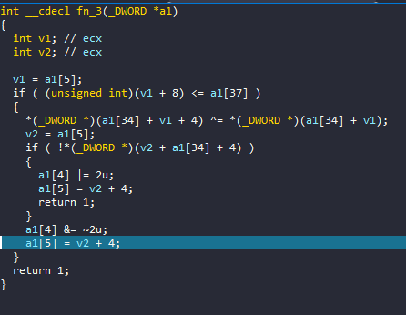

Tiếp tục `fn_8` và `fn_9` tạo ra string `0x89ABCDEF` trên eax, và gọi `fn_1` cộng string vừa rồi với 4 kí tự cuối của input.

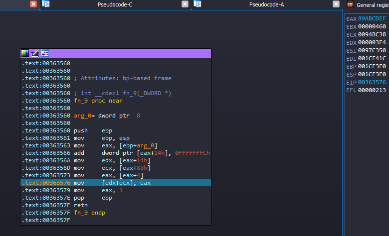

Sau đó là `fn_6`, thực hiện not string vừa xử lí.

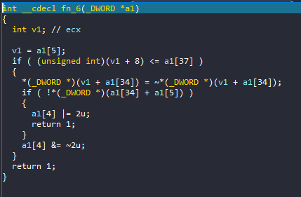

Tiếp tục, `fn_8` và `fn_9` tạo string `0x5469A57F` trên eax, cuối cùng gọi `fn_15` để so sánh.

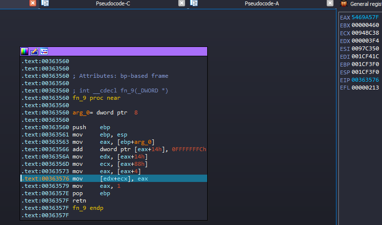

```rust
fn main() {
    let p3: u32 = 0x5469A57F;
    let p3 = !((!p3 - 0x89ABCDEF) ^ 0xABBAABBA);
    let p3 = p3.rotate_left(4);

    println!("{:X}", p3);
}
```

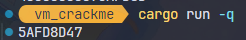

Đảo ngược `fn_26` và đổi ra ASCII.

Part 3: `Huct`

Ghép 3 part lại, key là `R0DE7a6iHuct`.

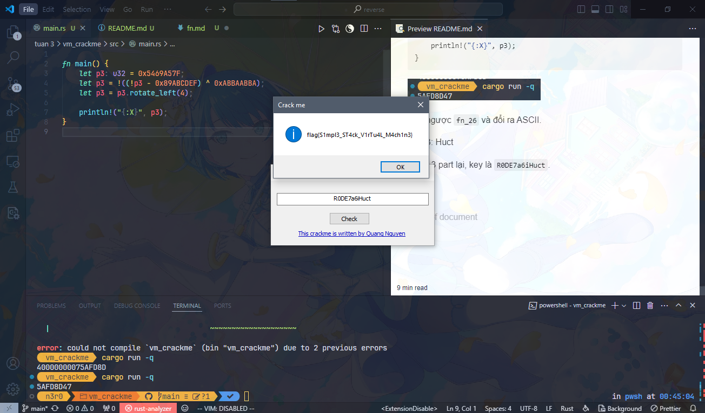

Flag: `flag{S1mpl3_ST4ck_V1rTu4L_M4ch1n3}`